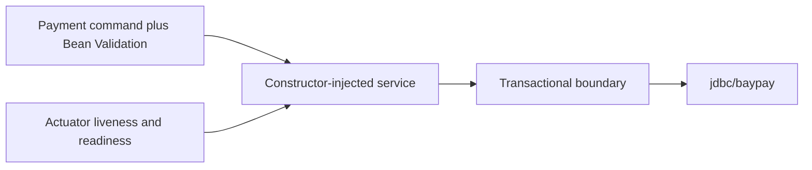

# L-16.2 — Spring / Jakarta round

**Module:** 16 — Advanced Engineer Interview Simulator  
**Duration:** 30 minutes  
**Case study:** BayPay Financial Services (fictional)

---

## Why this matters

A panel that asks why a refund vanished will not be impressed by “I use `@Transactional`.” They want to know whether Riley Okonkwo can defend the **boundary**: constructor injection, Bean Validation on the payment command, a worker that must not hold an open persistence context across a network call, and whether Spring Security or Jakarta security is the story on Liberty. Harbor Bike Co still posts Avery Chen’s `$84.00` to `POST /api/v1/payments`. One Spring slogan at every seniority fails. Practice handles: [AEJE-IQ-021](../../../../interview-bank/README.md) (constructor versus field injection) and [AEJE-IQ-023](../../../../interview-bank/README.md) (`@Transactional` that silently swallowed a refund). Do not paste bank answers.

---

## Learning objectives

- Open a Spring/Jakarta id and write four maturity layers before `--reveal`.
- Defend constructor injection, validation on the command, and a transaction boundary you can draw.
- Separate Actuator exposure from “we have health, so we are safe.”
- Sit INTERVIEW-1601 (practice) using one JVM id from L-16.1 and one id from this lesson.

---

## Concept explanation

Spring/Jakarta is **10** of **100** (`AEJE-IQ-021`–`AEJE-IQ-030`). The slice covers IoC, Bean Validation, transaction boundaries, OpenEntityManagerInView on a worker, JTA versus Spring when a JMS send must enlist, Actuator attack surface, Testcontainers for persistence, and when Boot on Liberty is the wrong runtime. You shipped these ideas in the reference app. The interview job is to **draw the box**.

**Boundary first.** Engineer: constructor injection makes the graph honest; field injection hides a missing collaborator until the first create. Senior: `@Transactional` on the wrong type or the wrong exception swallows a refund while HTTP still says 200. Staff: OEMIV on a payment worker is a connection and latency tax, not a convenience. Principal: if the team cannot say whether this runtime is Spring Security on Boot or Jakarta security on Liberty, the platform is undecided — that is an architecture defect.

**Actuator is a door.** Liveness and readiness on `8080` are the contract. Exposing every endpoint because a demo dashboard wanted them is an attack surface. Name what is public, what is authenticated, and what never ships.

**Jakarta mapping.** AEJE-IQ-030 asks a Spring-trained team to name the Jakarta twin: CDI versus `@Component`, interceptors versus AOP, Bean Validation on both stacks. Engineer maps the annotation. Senior says which runtime owns security. Staff refuses a hybrid that loads both stacks “so nobody argues.”

**What you do not do.** Do not claim JTA because a slide said “enterprise.” Do not move a leftover ND cell into Docker to “run Spring.” Do not recite INCIDENT titles as transaction RCAs. Symptom classes (behind-proxy 200, worker still `VALIDATING`, pool wait) stay classes.

Run:

```bash
python3 interview-bank/simulator.py --mode practice --domain Spring/Jakarta
python3 interview-bank/simulator.py --mode practice --id AEJE-IQ-023
```

INTERVIEW-1601 is the graded practice sitting after this lesson. No timer required. Timed variant is allowed; quality bar does not drop.

---

## Visual explanation



Alt text: A Spring/Jakarta interview sketch: a validated payment command enters a constructor-injected service, crosses one drawn transaction boundary to jdbc/baypay, and exposes only liveness and readiness — not every Actuator endpoint.

---

## Architecture

Spoken estate: modular monolith, Java 21, Spring Boot 3.5.5, `POST /api/v1/payments` with `Idempotency-Key`, health on `/actuator/health/liveness` and `/actuator/health/readiness`. Persistence is the teaching DataSource. When Liberty is named, say whether the feature set or Spring Security is the control plane — do not mash them. When AWS is named, still `us-west-2`; do not apply RDS Multi-AZ to win the round.

Riley owns the service graph and the transaction drawing. Priya owns whether a 200 is an SLI success. Sam owns what Actuator is reachable from the mesh or ALB. Jordan owns a Boot version bump as an immutable tag. Morgan’s cell is not where you “enable JTA to be safe.”

Testcontainers (AEJE-IQ-029) is a spoken strategy, not a required live Docker run: prove persistence against a throwaway engine in CI, keep PAN out of fixtures, and say what you still mock.

---

## Production example

22:10 Pacific. A refund handler returns 200. Avery’s account does not move. A panelist says “transactions.” Engineer: I draw the method that must commit the ledger intent and the method that only sends a message. If the runtime exception was caught inside the proxy, Spring will commit. Senior: I name the exception type and whether it is unchecked; I will not add `rollbackFor=Exception` as theater. Staff: I ask whether the JMS send needed enlistment (AEJE-IQ-026 territory) or whether this is a single resource. Principal: a swallowed refund is a product-trust failure; I fund a test that proves rollback, not another annotation.

A second prompt is AEJE-IQ-021. Engineer: constructors. Senior: I reject field injection in money types. Staff: I use the graph to keep test fakes honest. Principal: if new services keep adding `@Autowired` fields, that is a hiring and review problem, not a style nit.

---

## Code/configuration example

Spoken outline for a transaction prompt — your words, not a reveal:

```text
1. Restate the HTTP contract: POST /api/v1/payments, Idempotency-Key, ProblemDetail errors.
2. Draw one box: which method starts the transaction, which collaborators are inside it.
3. Name the failure: exception type, self-invocation, or OEMIV spanning IO.
4. Name the check: a test that expects rollback, or a log line with paymentId and outcome.
5. Raise seniority: policy (what we forbid) rather than another annotation.
```

Illustrative bank-shaped draft — **not** AEJE-IQ-023’s answer:

```json
{
  "id": "AEJE-IQ-023",
  "domain": "Spring/Jakarta",
  "difficulty": "senior",
  "question": "<simulator prompt>",
  "followUps": ["What exception type commits?", "Where would OEMIV hurt a worker?"],
  "expectedConcepts": ["proxy boundary", "unchecked rollback", "single resource vs JTA"],
  "engineerAnswer": "<draw the method>",
  "seniorAnswer": "<exception and test>",
  "staffAnswer": "<JTA only if a second resource enlists>",
  "principalAnswer": "<fund the rollback test; do not add ND-in-Docker>"
}
```

Do not put secrets in `application.yml` excerpts you speak. Do not dump `management.endpoints.web.exposure.include=*`.

---

## Trade-offs

| Choice | Gain | Cost |
|---|---|---|
| Constructor injection | Honest graph; testable | More constructors |
| Field injection | Fast typing | Hidden nulls in money code |
| Broad `@Transactional` | Feels safe | Long locks; swallowed work |
| Every Actuator endpoint | Easy demo | Attack surface |
| JTA by default | Slide-friendly | Complexity you cannot operate |

---

## Failure modes

- “I use Spring” as the whole Senior answer.
- Catching exceptions inside a transactional proxy and calling it success.
- OEMIV on a worker that calls out while a session is open.
- Exposing all Actuator endpoints to make a dashboard green.
- Requiring a live Testcontainers run to pass a spoken round.
- Recommending ND-in-Docker so “Jakarta and Spring can both run.”

---

## Security/reliability implications

Actuator and OpenAPI are reconnaissance if they are public. Keep liveness/readiness as the load-balancer contract; lock everything else down. Validation is a security control: reject bad amounts and currencies before persistence. Reliability: a transaction that reports 200 and does not move money burns Priya’s 99.9% budget and merchant trust. Tests that prove rollback are cheaper than a SEV-1.

---

## Interview perspective

**Engineer.** I inject via constructors and validate the payment command. I can draw one `@Transactional` method.

**Senior.** I name the exception and the proxy. I treat a swallowed refund as a test miss, not bad luck.

**Staff.** I decide Spring versus Jakarta security by runtime, and I keep OEMIV off workers.

**Principal.** I will not accept “Boot on Liberty plus ND-in-Docker.” Runtimes are chosen; they are not stacked.

---

## Key takeaways

- Spring/Jakarta is 10 of 100. Practice `--domain Spring/Jakarta` or `--id AEJE-IQ-021` / `AEJE-IQ-023`.
- Draw the transaction. Do not chant the annotation.
- Actuator exposure is a security decision.
- Four layers. Reveal after writing.
- INTERVIEW-1601 starts after this lesson.

---

## Knowledge check

1. Why is field injection a weaker Engineer answer than constructor injection on a payment service?
2. A handler catches `RuntimeException`, logs, and returns 200 inside `@Transactional`. What class of miss is that?
3. Is a BayLearn interview UI required to pass INTERVIEW-1601?

<details>
<summary>Spoiler — answers</summary>

1. Constructors fail fast when a collaborator is missing; fields stay null until the first create.
2. A swallowed-transaction / false-success class — HTTP 200 with no durable refund. Draw the proxy and the exception type.
3. No. Phase A is paper plus `interview-bank/simulator.py`.

</details>

---

## Related lab

[INTERVIEW-1601](../../../../labs/INTERVIEW-1601/README.md) — Practice mode, after this lesson (and L-16.1). Time-box 45–75 minutes. Open at least one Java/JVM id and one Spring/Jakarta id. Write Engineer + Senior (or Staff), then compare. This lesson does not complete the lab and does not print bank answers.

---

## Related PAKS

Optional: `docs/30-mock-interviews/overview.md` on [paks.bayareala8s.com](https://paks.bayareala8s.com). Practice-mode discipline lives there. This lesson stands alone without it.
