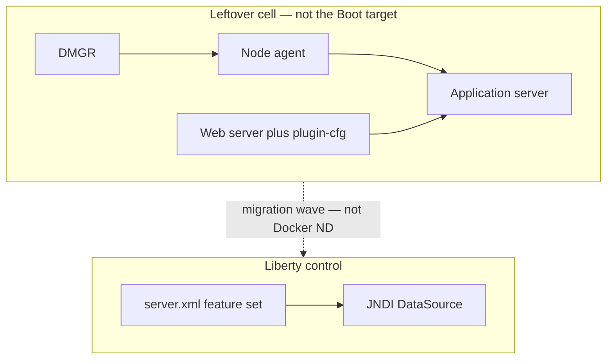

# L-16.3 — WebSphere / Liberty round

**Module:** 16 — Advanced Engineer Interview Simulator  
**Duration:** 30 minutes  
**Case study:** BayPay Financial Services (fictional)

---

## Why this matters

A panel that still runs a cell will ask Riley Okonkwo to name **DMGR, node agent, and application server** without turning BayPay’s leftover estate into the target architecture. Harbor Bike Co charges Avery Chen through the Boot process on `8080`. Morgan Hale still has `dmgr-east` / `PaymentCluster`. The winning answer defends *why* you migrate a wave — or why you do **not** leave WebSphere yet — and never proposes ND-in-Docker. Practice handles: [AEJE-IQ-031](../../../../interview-bank/README.md) (cell, DMGR, node agent, application server) and [AEJE-IQ-039](../../../../interview-bank/README.md) (Liberty feature set as an architecture control). Do not paste bank answers.

---

## Learning objectives

- Sketch a traditional cell versus a Liberty `server.xml` in four maturity layers.
- Defend JNDI DataSource, classloader policy, and session affinity as *decisions*, not folklore.
- Refuse ND-in-Docker and refuse bouncing `dmgr-east` as the Boot remediation.
- Keep rapid-fire depth for later (INTERVIEW-1602 after several domain rounds).

---

## Concept explanation

WebSphere/Liberty is **15** of **100** (`AEJE-IQ-031`–`AEJE-IQ-045`). Topics include plugin-cfg routing, JNDI versus a Spring DataSource on ND, affinity versus a stateless payment API, parent-first versus parent-last, one cluster member that stops consuming JMS, JDBC pool versus database saturation, a failed EAR rollout, migration waves, secrets off the cell, SSL between plugin and member, and an honest compatibility assessment.

**Two estates, one company.** Engineer: I can name the processes in a cell and the features in `server.xml`. Senior: I can say why a payment API should be stateless even if the old UI needed affinity. Staff: I treat Liberty features as an allow-list — each feature is attack surface and operational load. Principal: waves and rollback are a bank-platform program, not a weekend cut; I will also say when *not* to leave WebSphere yet (AEJE-IQ-045).

**Pools and routing are classes.** “Member not consuming JMS” is a symptom class. “Pool exhausted” is a symptom class. “EAR update failed” is a symptom class. Interview method: evidence you would open (pool PMI, listener status, plugin-cfg generation time), then a hypothesis, then the next gate. Do not import an instructor RCA from a MODERNIZE lab as the only story.

**What you do not do.** Do not put traditional ND in a container and call it cloud. Do not store `BAYPAY_DB_*` in a cell-wide custom property you cannot rotate. Do not treat the admin console and `server.xml` as interchangeable without saying who owns change.

Run:

```bash
python3 interview-bank/simulator.py --mode practice --domain WebSphere/Liberty
python3 interview-bank/simulator.py --mode practice --id AEJE-IQ-031
```

---

## Visual explanation



Alt text: Traditional cell processes sit on the leftover estate; Liberty is controlled by a feature-set server.xml. Migration is a wave, not WebSphere ND running in Docker.

---

## Architecture

Spoken leftover: cell, DMGR, node, cluster member, IHS/plugin. Spoken target for new work: Liberty or Boot, not both mashed into one JVM “to be safe.” JNDI remains the ND way to hand out `jdbc/baypay`. Boot on Fargate in `us-west-2` is a different estate — do not bounce the cell when the Boot P99 is red.

Morgan owns leftover truth. Riley owns the application contract. Sam owns whether Liberty features are a platform template. Jordan owns EAR or image rollback. Priya owns whether merchants are still completing. Secrets leave the cell into a store you can rotate (AEJE-IQ-042 territory) — still no live apply required to say that.

---

## Production example

A panelist asks you to walk a cell (AEJE-IQ-031). Engineer: DMGR is the manager; node agent hosts the member; the application server runs the EAR. Senior: I will not restart DMGR to fix one member’s JMS listener. Staff: I separate plugin routing evidence from JVM evidence; a stale plugin-cfg is a routing class. Principal: this cell is a decommission program with rollback waves, not a HA target for 99.99%.

A second panelist asks why Liberty features matter (AEJE-IQ-039). Engineer: features load APIs. Senior: I enable only what the payment app needs. Staff: a fat feature set is a CVE and startup bill. Principal: the feature file is an architecture control, same as a Boot starter allow-list.

---

## Code/configuration example

Spoken outline — cell versus Liberty — not a leaked assessment:

```text
1. Name the estate you are in: leftover ND or Liberty or Boot.
2. Name the control plane: admin console / wsadmin versus server.xml.
3. Name one operational check: plugin-cfg timestamp, pool in-use, listener state.
4. Name the forbidden move: ND-in-Docker, bounce dmgr-east for a Boot symptom.
5. If asked about migration: wave, rollback, honest API gaps — not a big-bang weekend.
```

Illustrative record shape for practice notes:

```json
{
  "id": "AEJE-IQ-039",
  "domain": "WebSphere/Liberty",
  "difficulty": "staff",
  "question": "<simulator prompt>",
  "followUps": ["Which feature do you refuse?", "How do you roll back a wave?"],
  "expectedConcepts": ["feature allow-list", "startup and CVE cost", "server.xml as control"],
  "engineerAnswer": "<features load APIs>",
  "seniorAnswer": "<enable only what payment-service needs>",
  "staffAnswer": "<treat server.xml like a platform contract>",
  "principalAnswer": "<waves; never ND-in-Docker>"
}
```

Do not paste a real `BAYPAY_DB_PASSWORD` into a spoken `server.env`.

---

## Trade-offs

| Choice | Gain | Cost |
|---|---|---|
| Honest leftover cell sketch | Panel trust | You must also know Liberty |
| ND-in-Docker | Looks modern | Unsupported; ops fiction |
| Session affinity for APIs | Hides bad design | Sticky outages |
| Fat Liberty feature set | “It runs” | CVE and start time |
| Big-bang leave-WebSphere | Slide | No rollback |

---

## Failure modes

- Restarting DMGR as the first move for one sick member.
- Treating plugin-cfg, JVM, and database as one blob called “WAS is down.”
- Parent-last as a reflex without a classpath story.
- Recommending ND-in-Docker or bouncing `dmgr-east` for Boot.
- Claiming the app is stateless while still requiring affinity.
- A compatibility assessment that pretends every ND API exists on Liberty.

---

## Security/reliability implications

Cell-wide credentials and uncleared plugin SSL are blast radius. Externalize secrets; rotate; do not leave passwords in console custom properties. Reliability: one member that stops consuming JMS is a silent backlog, not a green console. Feature allow-lists reduce attack surface the same way Boot starter hygiene does. Leftover cells are decommission risk, not DR targets.

---

## Interview perspective

**Engineer.** I can name DMGR, node agent, application server, and a Liberty feature.

**Senior.** I separate routing, pool, and listener evidence. I do not reboot the cell for one symptom class.

**Staff.** `server.xml` is a control. Affinity is not a payment-API strategy.

**Principal.** Waves, rollback, and “not yet” are acceptable answers. ND-in-Docker is not.

---

## Key takeaways

- WebSphere/Liberty is 15 of 100. Practice `--id AEJE-IQ-031` and `AEJE-IQ-039`.
- Two estates: leftover cell versus Liberty/Boot. Do not mash them.
- Symptom classes stay classes. No imported instructor RCA.
- Never ND-in-Docker. Never bounce `dmgr-east` for Boot.
- Rapid fire (INTERVIEW-1602) comes after several more domain rounds.

---

## Knowledge check

1. Name the three traditional processes you must be able to place on a cell sketch.
2. Why is ND-in-Docker a failing Principal answer even if the leftover cell is real?
3. A member “stops consuming JMS.” What do you do first in interview method?

<details>
<summary>Spoiler — answers</summary>

1. DMGR, node agent, application server (plus plugin/web server if asked about routing).
2. It is not a supported modernization path and it hides the leftover estate instead of waving it down.
3. Treat it as a symptom class: name evidence (listener, pool, plugin), write a hypothesis, name the next gate — do not announce RCA.

</details>

---

## Related lab

[INTERVIEW-1602](../../../../labs/INTERVIEW-1602/README.md) — Rapid fire, **after several domain rounds** (through L-16.6). This lesson only adds WAS/Liberty prompts to your practice list. Do not sit 1602 yet. Depth is not that lab’s grade; short, correct-enough answers are.

---

## Related PAKS

Optional: `docs/30-mock-interviews/overview.md` on [paks.bayareala8s.com](https://paks.bayareala8s.com). Mock discipline applies to leftover-estate questions too. This lesson stands alone without it.
