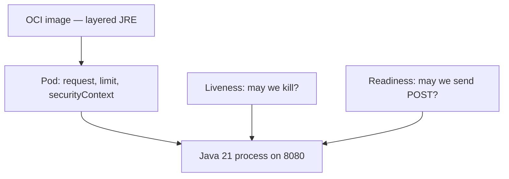

# L-16.4 — Containers / Kubernetes round

**Module:** 16 — Advanced Engineer Interview Simulator  
**Duration:** 30 minutes  
**Case study:** BayPay Financial Services (fictional)

---

## Why this matters

A panel that asks why a canary died will not accept “Kubernetes restarted it.” They want Riley Okonkwo to defend **image layers, a read-only root, requests versus limits versus `-Xmx`, and liveness versus readiness** for a slow-starting Java 21 JVM. Harbor Bike Co still posts Avery Chen’s `$84.00` to a task that must be *ready* before it receives `POST /api/v1/payments`. One YAML slogan at every seniority fails. Practice handles: [AEJE-IQ-048](../../../../interview-bank/README.md) (requests/limits versus heap and container OOM) and [AEJE-IQ-049](../../../../interview-bank/README.md) (liveness versus readiness for a slow-starting JVM). Do not paste bank answers.

---

## Learning objectives

- Speak image, security context, probes, and memory as four separate decisions.
- Refuse `-Xmx` equal to the cgroup / memory limit.
- Treat `CrashLoopBackOff` and `OOMKilled` as symptom classes, not closed RCAs.
- Keep OpenShift Route versus Ingress versus mesh as a Staff trade-off, not a religion.

---

## Concept explanation

Containers/Kubernetes/OpenShift is **15** of **100** (`AEJE-IQ-046`–`AEJE-IQ-060`). The slice includes fat versus layered JRE, read-only root, CrashLoop from a bad Spring profile, `OOMKilled` with heap left, Route versus Ingress versus mesh, pipeline RBAC, golden path versus team charts, rollout/rollback, ConfigMap versus Secret versus CSI, certificate rotation, canary routing, HPA on CPU versus SLO, and when Kubernetes is optional.

**Probes are jobs, not decorations.** Liveness answers “should this process be killed?” Readiness answers “may it receive Avery’s POST?” A slow JVM that is killed because liveness used the same tight timeout as readiness is a self-inflicted outage class. Engineer names the two Actuator paths on `8080`. Senior names startup delay and period. Staff names who owns the probe contract (platform versus app). Principal refuses a mesh-plus-Ingress-plus-Route stack “for completeness.”

**Memory is three numbers.** Request, limit, and `-Xmx` (plus native). `OOMKilled` with “plenty of heap” is a native/metaspace/stack class until proven otherwise. Do not set heap equal to the limit.

**Rollout is a contract.** AEJE-IQ-055 wants a canary that can fail closed: previous ReplicaSet or image, readiness gating the Service, and a human who can pin. A Service that silently selected the wrong canary (AEJE-IQ-058) is a routing class — quote selectors and endpoints, do not guess.

**What you do not do.** Do not require a live cluster to pass the spoken round. Do not dump PAN into a ConfigMap. Do not treat HPA-on-CPU as the payment scaler without an SLO sentence. Kubernetes is optional for some BayPay workloads (AEJE-IQ-060); ECS on Fargate remains a valid home.

Run:

```bash
python3 interview-bank/simulator.py --mode practice --domain Containers/Kubernetes/OpenShift
python3 interview-bank/simulator.py --mode practice --id AEJE-IQ-049
```

---

## Visual explanation



Alt text: A payment container starts from a layered image, runs under request and limit, and splits liveness (kill) from readiness (receive POST) for the Java 21 process on port 8080.

---

## Architecture

Spoken cluster is paper: namespace for `payment-service`, Service, probe paths on `8080`, image from a registry you already trust. When OpenShift is named, Route is an option, not a requirement to also have Ingress and a mesh. When AWS is named, remember ECS/Fargate is the course default — you may still defend EKS or OpenShift with reasons (L-16.5). Sam owns golden paths and RBAC that lets a pipeline deploy *only* BayPay. Riley owns Actuator. Priya owns whether HPA fights the SLO. Jordan owns rollback that is a previous image, not a force-push.

Linux/Networking/TLS items in the bank (timeouts, SNI, conntrack, mTLS) may appear as follow-ups. Treat them as planes: TCP timeout is not application timeout; CloudWatch is not a trace. Certificate rotation without downtime (AEJE-IQ-057) is a dual-cert or dual-secret story — not a restart of every payment task at once.

---

## Production example

A canary is `CrashLoopBackOff`. A panelist smiles. Engineer: I read the last termination reason and the first log line; a bad Spring profile is a class, not a verdict. Senior: I will not delete the Deployment to “clear it.” Staff: I ask whether the golden path injected `SPRING_PROFILES_ACTIVE` twice. Principal: CrashLoop without a rollout contract is a platform miss.

Memory prompt (AEJE-IQ-048). Engineer: three numbers — request, limit, heap. Senior: `-Xmx` stays below the limit with room for native. Staff: `OOMKilled` plus a healthy heap histogram points off-heap. Principal: I will not buy a bigger node until NMT or RSS attribution exists.

Probe prompt (AEJE-IQ-049). Engineer: liveness ≠ readiness. Senior: give the JVM time to JIT and warm pools. Staff: readiness is the only signal that may take Avery’s POST. Principal: killing ready-enough JVMs to satisfy a copied probe YAML is an error-budget burn you authored.

---

## Code/configuration example

Spoken outline — probes and memory — not a cluster apply:

```text
1. Name port 8080 and the two Actuator paths.
2. Assign jobs: liveness kills; readiness admits POST /api/v1/payments.
3. Name three memory numbers: request, limit, -Xmx. Leave native room.
4. Name a symptom class: CrashLoopBackOff or OOMKilled — evidence next, not RCA.
5. Name a forbid: read-write root without a reason; secrets in a ConfigMap; ND-in-Docker.
```

Illustrative record shape:

```json
{
  "id": "AEJE-IQ-048",
  "domain": "Containers/Kubernetes/OpenShift",
  "difficulty": "senior",
  "question": "<simulator prompt>",
  "followUps": ["What if heap looks fine after OOMKilled?", "Where does NMT fit?"],
  "expectedConcepts": ["request", "limit", "heap vs native", "cgroup"],
  "engineerAnswer": "<three numbers>",
  "seniorAnswer": "<heap below limit>",
  "staffAnswer": "<OOMKilled plus free heap is off-heap until proven>",
  "principalAnswer": "<platform memory contract; no -Xmx equals limit>"
}
```

Do not apply EKS “to make the YAML real.” Paper is enough.

---

## Trade-offs

| Choice | Gain | Cost |
|---|---|---|
| Split probes | Safer deploys | More YAML to review |
| One probe for both | Simple | Kill-on-not-ready class |
| `-Xmx` = limit | Feels maximal | `OOMKilled` |
| HPA on CPU | Built-in | Misses payment SLO |
| K8s for every workload | Uniform | Optional for some BayPay paths |

---

## Failure modes

- Liveness that uses the same tight check as readiness on a cold JVM.
- `-Xmx` equal to the memory limit.
- Secrets in a ConfigMap or an image layer.
- Declaring RCA from `CrashLoopBackOff` or `OOMKilled` alone.
- Requiring a live cluster or OpenShift license to pass.
- Adding mesh + Ingress + Route because a blog had all three.

---

## Security/reliability implications

A writable root and a fat image are supply-chain and persistence risks. Prefer read-only root, non-root user, and a layered JRE you can scan. Secrets belong in a Secret or CSI store, not a ConfigMap. Reliability: bad probes flap merchants; bad limits kill healthy JVMs; HPA on the wrong signal oscillates capacity. RBAC that can deploy only BayPay is safer than cluster-admin for a pipeline.

---

## Interview perspective

**Engineer.** I split liveness and readiness and I name request, limit, and heap.

**Senior.** I leave native room. I treat CrashLoop and OOMKilled as classes.

**Staff.** I pick Route *or* Ingress *or* mesh with a reason, and I keep secrets off ConfigMaps.

**Principal.** Kubernetes is a choice, not a virtue. I will fund a golden path and refuse ND-in-Docker.

---

## Key takeaways

- Fifteen container/cluster records. Practice `AEJE-IQ-048` and `AEJE-IQ-049`.
- Probes have jobs. Memory has three numbers.
- Symptom classes stay classes.
- Paper YAML is enough. No live cluster required.
- INTERVIEW-1602 still waits until after L-16.6.

---

## Knowledge check

1. What job does readiness do that liveness must not do for `payment-service`?
2. Why is `-Xmx` equal to the container memory limit a fail?
3. Name one reason Kubernetes might be *optional* for a BayPay workload.

<details>
<summary>Spoiler — answers</summary>

1. Readiness admits `POST /api/v1/payments`. Liveness kills the process. Using liveness to drain traffic (or to kill a still-starting JVM) is the wrong job.
2. Stacks, metaspace, and native still need RSS; the kernel OOM-kills the container.
3. ECS on Fargate is the teaching default; some services do not earn a cluster until the platform team can operate it.

</details>

---

## Related lab

[INTERVIEW-1602](../../../../labs/INTERVIEW-1602/README.md) — Rapid fire, after several domain rounds (through L-16.6). Add one container/cluster id to your practice list now. Do not sit 1602 yet. Short answers; depth is not the grade.

---

## Related PAKS

Optional: `docs/30-mock-interviews/overview.md` on [paks.bayareala8s.com](https://paks.bayareala8s.com). Probe and memory answers still need timed discipline. This lesson stands alone without it.
