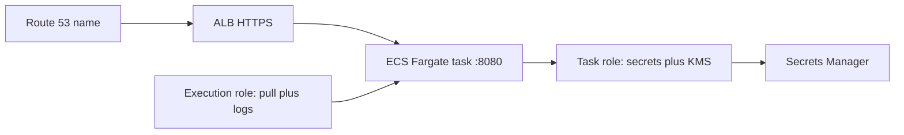

# L-16.5 — AWS round

**Module:** 16 — Advanced Engineer Interview Simulator  
**Duration:** 30 minutes  
**Case study:** BayPay Financial Services (fictional)

---

## Why this matters

A panel that asks “ECS or EKS?” is grading whether Sam Okada can defend **this quarter’s BayPay**, not a cloud-provider brochure. Harbor Bike Co still reaches Avery Chen through an HTTPS front door to tasks in **`us-west-2`**. The teaching default is **ECS on Fargate**. A Staff answer names when Fargate wins, when EKS wins, and when OpenShift stays. It does not apply EKS in a 90-minute lab to look serious. Practice handles: [AEJE-IQ-062](../../../../interview-bank/README.md) (task role versus execution role) and [AEJE-IQ-064](../../../../interview-bank/README.md) (ECS versus EKS versus OpenShift). Do not paste bank answers.

---

## Learning objectives

- Separate the ECS **task role** from the **execution role** and refuse `AdministratorAccess`.
- Defend ECS/Fargate as default and name the conditions that change the choice.
- Treat “ALB target unhealthy after a Java deploy” as a symptom class, not a closed RCA.
- Estimate idle cost (NAT, ALB, Fargate) on paper; do not apply NAT “for realism.”

---

## Concept explanation

AWS is **10** of **100** (`AEJE-IQ-061`–`AEJE-IQ-070`). Topics include ECR scan gates, roles, unhealthy targets, platform choice, Secrets Manager plus KMS, multi-account landing, CloudWatch logs versus traces, RDS failover versus retry semantics, idle cost, and what you refuse to run always-on.

**Roles are two doors.** Execution role pulls the image and writes logs. Task role is what `payment-service` uses at runtime (secrets, KMS, downstream). Engineer names both. Senior refuses merging them. Staff writes least privilege for `alias/baypay-payments`. Principal treats a shared `AdministratorAccess` lab role as a hiring fail.

**Front door is a class.** An unhealthy target after a deploy can be a probe path, a failed bind on `8080`, a security group, or a task that never became ready. Interview method: name the next evidence (target health reason, task stopped reason, Actuator). Do **not** lecture an instructor ALB listener story as the only RCA.

**Signals.** CloudWatch invocation or application logs are not a distributed trace. Say W3C `traceparent` when you mean a trace. RDS failover is not application idempotency — retries must be safe for Avery’s create.

Run:

```bash
python3 interview-bank/simulator.py --mode practice --domain AWS
python3 interview-bank/simulator.py --mode practice --id AEJE-IQ-064
```

Linux/Networking/TLS bank items (SNI, DNS TTL, mTLS) are fair follow-ups. Keep planes separate.

---

## Visual explanation



Alt text: Paper AWS path in us-west-2: DNS to an ALB to an ECS Fargate task on 8080. The execution role pulls the image; the task role reaches secrets and KMS — two roles, not AdministratorAccess.

---

## Architecture

Spoken region is **`us-west-2`**. Compute default is ECS on Fargate. Allowed *sketch* extras: ALB, ECR, Secrets Manager, KMS alias `alias/baypay-payments`, CloudWatch logs, optional traces. Do **not** apply NAT Gateway, EKS, OpenSearch, provisioned GPU, or a second region to win the mock. Multi-account landing (AEJE-IQ-066) is a paper org chart: prod isolated from build.

Sam owns roles and landing. Riley owns the process on `8080`. Priya owns whether logs answered the refund-timeout question or whether a trace was required. Jordan owns the immutable ECR tag and scan gate (AEJE-IQ-061). Morgan’s cell is not an AWS HA target.

---

## Production example

A panelist asks ECS vs EKS vs OpenShift (AEJE-IQ-064). Engineer: Fargate removes node ops for this monolith. Senior: I pay a task-shaped bill and accept AWS scheduling. Staff: EKS wins when we already operate Kubernetes contracts (probes, RBAC, golden path) and need portability; OpenShift stays if the bank already staffs it and needs Routes/SCCs. Principal: I will not run all three. I will write the ADR for *this quarter* and revisit when the ops load changes.

Role prompt (AEJE-IQ-062). Engineer: two roles. Senior: task role never pulls images. Staff: I can name the secret ARN and KMS key the task needs. Principal: I kill shared admin roles even in labs we do not apply.

Unhealthy target after a Java deploy (AEJE-IQ-063). Engineer: I ask the target health reason and the task exit. Senior: I check readiness on `8080`, not a guess about “AWS is down.” Staff: I keep change and probe evidence on one timeline. Principal: I will not accept a listener-folklore RCA without files.

---

## Code/configuration example

Spoken outline — platform choice and roles:

```text
1. Name region us-west-2 and default compute: ECS on Fargate.
2. Split roles: execution = pull + logs; task = runtime AWS API.
3. If asked ECS vs EKS vs OpenShift: one winner this quarter, two rejected with reasons.
4. If asked unhealthy target: symptom class → next evidence (health reason, exit, Actuator).
5. Refuse: NAT apply, AdministratorAccess, always-on extras, dmgr-east as failover.
```

Illustrative record shape:

```json
{
  "id": "AEJE-IQ-064",
  "domain": "AWS",
  "difficulty": "staff",
  "question": "<simulator prompt>",
  "followUps": ["What would make you pick EKS?", "What do you refuse to run always-on?"],
  "expectedConcepts": ["Fargate default", "ops load", "one platform this quarter"],
  "engineerAnswer": "<Fargate for this monolith>",
  "seniorAnswer": "<bill and scheduling trade-off>",
  "staffAnswer": "<when EKS or OpenShift wins>",
  "principalAnswer": "<one ADR; do not apply EKS for the mock>"
}
```

Do not put live access keys in the draft. Do not require `terraform apply`.

---

## Trade-offs

| Choice | Gain | Cost |
|---|---|---|
| ECS Fargate default | Less node ops | AWS-shaped limits |
| EKS | K8s contracts | Cluster bill and staff |
| OpenShift stay | Existing skills | Two clouds to explain |
| Merged IAM role | Demo speed | Blast radius |
| Always-on NAT + extras | Feels “real” | Idle burn |

---

## Failure modes

- “AWS is the only correct platform.”
- One IAM role for pull, logs, and runtime.
- Declaring RCA from “target unhealthy” without a reason code.
- Calling CloudWatch logs a trace.
- Applying NAT, EKS, or a second region to pass the round.
- Failing over to `dmgr-east`.

---

## Security/reliability implications

Task role is the production identity. Over-broad IAM is a payments incident waiting for a CVE. Secrets Manager plus KMS envelope is the teaching pattern; never git, never a task definition plaintext password. Reliability: RDS failover without idempotent retries double-charges or drops Harbor Bike Co. Idle NAT and empty Fargate are reliability-neutral bills — refuse them in labs and explain them in prod.

---

## Interview perspective

**Engineer.** Two roles. Fargate default. Region `us-west-2`.

**Senior.** I will not merge roles. Unhealthy target is a class.

**Staff.** I name when Fargate, EKS, or OpenShift wins *this quarter*.

**Principal.** One platform ADR. No admin role. No always-on extras for a mock.

---

## Key takeaways

- AWS is 10 of 100. Practice `AEJE-IQ-062` and `AEJE-IQ-064`.
- Task role ≠ execution role.
- Unhealthy target and failover are classes until evidenced.
- Paper in `us-west-2`. Do not apply NAT or EKS to pass.
- INTERVIEW-1602 still waits until after L-16.6.

---

## Knowledge check

1. What does the ECS execution role do that the task role must not do?
2. A Staff answer about ECS vs EKS should contain which three outcomes?
3. Why is a live EKS apply not required to pass this round?

<details>
<summary>Spoiler — answers</summary>

1. Execution pulls the image and writes logs. Task role calls AWS APIs at runtime. Do not merge them.
2. When Fargate wins, when EKS wins, and when OpenShift stays — for BayPay this quarter.
3. Phase A is paper plus the simulator. Applying EKS is out of scope and idle-bills the student.

</details>

---

## Related lab

[INTERVIEW-1602](../../../../labs/INTERVIEW-1602/README.md) — Rapid fire, after several domain rounds (through L-16.6). Add one AWS id to your practice list. Do not sit 1602 yet.

---

## Related PAKS

Optional: `docs/30-mock-interviews/overview.md` on [paks.bayareala8s.com](https://paks.bayareala8s.com). Platform-choice answers still need timed structure. This lesson stands alone without it.
