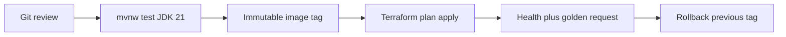

# L-16.6 — Automation round

**Module:** 16 — Advanced Engineer Interview Simulator  
**Duration:** 30 minutes  
**Case study:** BayPay Financial Services (fictional)

---

## Why this matters

A panel that asks “how do you ship?” is grading whether Jordan Voss can defend a **path**, not a logo salad. Harbor Bike Co should receive Avery Chen’s `$84.00` from an immutable tag that passed tests *before* an image existed, landed through reviewed Terraform, and can roll back without prayer. A green pipeline is still not a merchant-healthy cut. Practice handles: [AEJE-IQ-072](../../../../interview-bank/README.md) (CI that proves tests before an image exists) and [AEJE-IQ-078](../../../../interview-bank/README.md) (rollback that is not “redeploy the last tag and pray”). Do not paste bank answers.

---

## Learning objectives

- Order Git → test on Java 21 → image → apply → validate → rollback as spoken architecture.
- Separate pipeline green from payment health on `POST /api/v1/payments`.
- Name Terraform state blast radius and why copy-paste stacks fail Staff.
- Sit INTERVIEW-1602 (rapid fire) across several domains after this lesson.

---

## Concept explanation

Automation is **8** of **100** (`AEJE-IQ-071`–`AEJE-IQ-078`). Topics include branching for payment releases, CI-before-image, Terraform state and blast radius, module boundaries versus copy-paste stacks, Ansible versus user-data versus immutable images, pipeline gates that match change management, deployment validation you trust more than a green build, and rollback.

**Order is the answer.** Engineer: `./mvnw test` on JDK 21 happens before `docker build`. Senior: the image tag is immutable; we do not retag `latest` over a bad digest. Staff: Terraform state is a lock and a blast radius — one state file that can destroy prod and a lab is a fail. Principal: gates match change management (review, canary, health, rollback PR). A force-push to `main` is not a rollback.

**Validate is a different job from compile.** Health on `/actuator/health/readiness`, a synthetic create, RED on the golden request — pick what the prompt allows. “Pipeline green” is not that list.

**Config planes.** Ansible, user-data, and immutable images are three ways to change a host. For `payment-service`, prefer a new image over snowflake SSH. Leftover cells may still have Ansible; do not pretend they are Fargate.

Run:

```bash
python3 interview-bank/simulator.py --mode practice --domain Automation
python3 interview-bank/simulator.py --mode rapid-fire --count 8 --seed 16
```

Rapid fire prints prompts only. Sixty to ninety seconds spoken. Depth is not the grade — that is INTERVIEW-1602.

---

## Visual explanation



Alt text: Automation interview path: reviewed Git, tests on JDK 21 before an image exists, immutable tag, Terraform apply, validate health and the golden request, rollback to the previous tag — not a force-push.

---

## Architecture

Spoken pipeline lives next to the teaching estate: Java 21, `payment-service`, ECR or an internal registry, Terraform in `us-west-2` when AWS is named. State is remote and locked. Modules have boundaries (network, service, secrets) rather than one 4,000-line copy. Sam owns state and module design. Jordan owns branch policy and the rollback PR. Riley owns the readiness contract the pipeline must wait on. Priya owns whether validation looked at SLO burn, not only HTTP 200. Do not apply NAT or a second region to demonstrate CI.

Secrets never enter git or a pipeline log. `BAYPAY_DB_PASSWORD` is injected at runtime.

---

## Production example

A panelist asks what CI proves (AEJE-IQ-072). Engineer: unit and module tests on JDK 21 before Docker. Senior: I fail the pipeline if tests did not run, even if someone has a local image. Staff: I split verify from publish so a broken test cannot tag prod. Principal: I will not accept “we build on the laptop and push.”

Rollback (AEJE-IQ-078). Engineer: previous immutable tag. Senior: I pin the last good ECS revision or Terraform apply of the known tag. Staff: I have a validation that tells me the pin worked (readiness + one create). Principal: rollback is a reviewed forward PR, not `git push --force` and not a leftover-cell bounce.

Branching (AEJE-IQ-071). Engineer: protected `main`. Senior: release branches only if the bank’s change policy needs them. Staff: I map pipeline gates to the change ticket. Principal: marketing same-day flags are a change-management prompt (see production-engineering items), not a reason to skip tests.

---

## Code/configuration example

Spoken outline — CI and rollback:

```text
1. Name the order: review, test, image, plan, apply, validate, rollback.
2. Name the JDK: 21. Name the command shape: ./mvnw test before docker build.
3. Name rollback: previous digest/tag + health. Not force-push. Not dmgr-east.
4. Name state: remote, locked, scoped. Copy-paste stacks are a Staff fail.
5. If rapid fire: stop at 60–90 seconds. Do not whiteboard Terraform modules.
```

Illustrative record shape:

```json
{
  "id": "AEJE-IQ-072",
  "domain": "Automation",
  "difficulty": "advanced",
  "question": "<simulator prompt>",
  "followUps": ["When does the image get a tag?", "What if someone pushes a local tarball?"],
  "expectedConcepts": ["test before image", "immutable tag", "JDK 21"],
  "engineerAnswer": "<mvnw test then build>",
  "seniorAnswer": "<fail if tests skipped>",
  "staffAnswer": "<verify job != publish job>",
  "principalAnswer": "<no laptop-to-prod; gates match change policy>"
}
```

Do not print live Terraform credentials in a worksheet.

---

## Trade-offs

| Choice | Gain | Cost |
|---|---|---|
| Test-before-image | Broken code never tags | Slower first publish |
| Immutable tags | Honest rollback | More registry hygiene |
| One giant state file | Fast demo | Blast radius |
| User-data snowflakes | Quick fix | Drift |
| Force-push rollback | Fast | History and trust loss |

---

## Failure modes

- Building the image first and “running tests if we have time.”
- Retagging `latest` over a bad digest.
- Copy-paste stacks with no module boundary.
- Rollback by force-push or by bouncing `dmgr-east`.
- Treating pipeline green as merchant health.
- Turning every rapid-fire item into a 15-minute design.

---

## Security/reliability implications

Pipelines are high-privilege identities. Least-privilege deploy roles, scanned images, and no secrets in logs are the security bar. Reliability: an apply without validation ships a dark outage; an apply without rollback ships a long one. Terraform state is a control plane — who can unlock it can destroy `payment-service`. Change gates exist so Priya’s 99.9% budget is not a suggestion.

---

## Interview perspective

**Engineer.** Tests on JDK 21 before the image. Rollback is the previous tag.

**Senior.** Immutable digest. Validation is health plus a golden request.

**Staff.** State blast radius and module boundaries. Gates match the change ticket.

**Principal.** Automation is change management at machine speed. No force-push. No ND-in-Docker.

---

## Key takeaways

- Automation is 8 of 100. Practice `AEJE-IQ-072` and `AEJE-IQ-078`.
- Order: test → image → apply → validate → rollback.
- Green pipeline ≠ payment health.
- Rapid fire: short answers, many items.
- INTERVIEW-1602 starts after this lesson.

---

## Knowledge check

1. Why must `./mvnw test` happen before the payment image exists?
2. What is wrong with rollback by `git push --force` to `main`?
3. Rapid fire grades which behavior — depth or coverage under time?

<details>
<summary>Spoiler — answers</summary>

1. A failing test must not produce a prod-capable tag. CI-before-image is the gate.
2. It rewrites history, skips review, and is not a reversible pin of a known digest.
3. Coverage under time: short, correct-enough answers. Depth is INTERVIEW-1604/1605.

</details>

---

## Related lab

[INTERVIEW-1602](../../../../labs/INTERVIEW-1602/README.md) — Rapid fire, after this lesson (and the domain rounds in L-16.3–L-16.5). Time-box 45–75 minutes. Example: `python3 interview-bank/simulator.py --mode rapid-fire --count 8 --seed 16`. This lesson does not complete the lab. Do not open a reveal during the timed burst.

---

## Related PAKS

Optional: `docs/30-mock-interviews/overview.md` on [paks.bayareala8s.com](https://paks.bayareala8s.com). Rapid-fire pacing lives there. This lesson stands alone without it.
