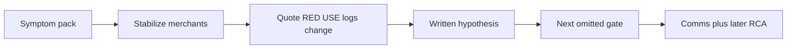

# L-16.7 — Production incident round

**Module:** 16 — Advanced Engineer Interview Simulator  
**Duration:** 30 minutes  
**Case study:** BayPay Financial Services (fictional)

---

## Why this matters

A troubleshooting interview is not trivia. Priya Nair pages because Harbor Bike Co’s creates miss P99 or throughput falls. The panel hands Riley Okonkwo a **symptom pack**, not an id that already contains the answer. A lucky RCA title does **not** max Diagnostic method (20 of the diagnostic weights). You must quote evidence, write a hypothesis that can be wrong, name the next gate, stabilize merchants, then remediate. Practice handles for *spoken* production-engineering items: [AEJE-IQ-087](../../../../interview-bank/README.md) (RED versus USE when P99 explodes and CPU is idle) and [AEJE-IQ-090](../../../../interview-bank/README.md) (RCA that names a system, not a person). INTERVIEW-1603 uses a pack, not a trivia id.

---

## Learning objectives

- Run evidence → hypothesis → next gate on a spoken pack without announcing proven RCA.
- Separate RED on `POST /api/v1/payments` from USE on heap, CPU, Hikari, and threads.
- Stabilize first; refuse bouncing `dmgr-east` for a Boot symptom.
- Score yourself on method, not on matching a lab title.

---

## Concept explanation

Production Engineering is **7** of **100** (`AEJE-IQ-086`–`AEJE-IQ-092`). HA/Security adds **4** (`AEJE-IQ-093`–`AEJE-IQ-096`). Linux/Networking/TLS adds timeout, handshake, DNS, and conntrack classes. The **troubleshooting mode** in [modes.md](../../../../interview-bank/modes.md) is lab INTERVIEW-1603: a symptom pack. Bank ids remain useful for SLI/SLO, capacity, change management, dashboards, and error-budget policy — they are not a substitute for the pack.

**Locked loop.** Orient (time, URI, SLO, who is paged). Stabilize (previous revision, fail readiness, disable a bad canary). Evidence (RED, USE, JSON logs with `correlationId` / `paymentId` / `outcome`, change list). Hypothesis (one falsifiable sentence). Remediate. Comms (audience, unknown, next update). Never PAN. Never `BAYPAY_DB_PASSWORD`.

**Symptom classes** you may name: P99 spike, throughput drop, idle CPU with high latency, handshake failure, timeout at TCP versus application, unhealthy target, saturation. Classes are not RCAs. Do not import instructor causes from earlier INCIDENT labs. Do not treat a metrics-change *timeline clue* as a verdict.

**Weights** when the item is diagnostic: Technical 25 / Method 20 / Production 15 / Trade-off 15 / Security 10 / Comms 10 / Efficiency 5. Method is how you moved. A correct guess with no quotes does not max it. Efficiency is a small slice — do not skip stabilize to look fast.

Run spoken PE items with:

```bash
python3 interview-bank/simulator.py --mode practice --domain "Production Engineering"
python3 interview-bank/simulator.py --mode practice --id AEJE-IQ-087
```

Do not expect `--mode troubleshooting` on the CLI; that mode is the lab pack.

---

## Visual explanation



Alt text: Troubleshooting interview flow: open a symptom pack, stabilize merchants, quote evidence, write a hypothesis, name the next gate, then communicate — RCA comes later and never from a lucky title.

---

## Architecture

Spoken ops estate: `payment-service` on `8080`, JSON fields `ts`, `level`, `logger`, `msg`, `correlationId`, `paymentId`, `outcome`, scrape names from the ops contract you already use, SLO **99.9%** monthly and P99 under 400 ms as the teaching ops numbers. Architecture 99.99% is a different conversation (design / HA items). Region `us-west-2` when AWS is named. Compute default ECS/Fargate. Morgan’s leftover cell is not on the page rota.

Riley owns app evidence. Priya owns SLO and pages. Jordan owns the change list. Sam owns scrape/platform if signal health is the story. CloudWatch logs are a search plane, not a trace, unless `traceparent` is present. Handshake and DNS-TTL classes from the Linux/Networking/TLS slice are fair follow-ups: say which plane you are on before you guess.

---

## Production example

20:11 Pacific. P99 on `POST /api/v1/payments` explodes. CPU is idle (AEJE-IQ-087 class). Engineer: I look at RED errors and duration, then USE on Hikari and servlet threads — idle CPU says “not compute starved.” Senior: I write “blocked on a pool or dependency” as *unproven* and I open pending/active connections. Staff: I refuse a CPU-HPA story; I ask for the change list and one `paymentId`. Principal: I will not accept an RCA that names a person; I want a system (pool, probe, retry, gate) and a detection gap.

Comms: Harbor Bike Co sees slower authorize; Avery’s PAN is never in Slack; next update in 15 minutes; rollback is on the table if Jordan’s tag is in the window. Stabilize might be fail-ready on a sick task or pin the last good revision. That is not RCA.

---

## Code/configuration example

Spoken outline — troubleshooting pack — **not** a leaked RCA:

```text
1. Orient: time, URI POST /api/v1/payments, SLO impact, Riley vs Priya.
2. Stabilize: what merchants need now. Not dmgr-east. Not restart Postgres from a red graph.
3. Quote: one panel, one log line (paymentId + outcome), one change.
4. Hypothesis: one sentence that the next gate could kill.
5. Next gate: the omitted evidence kind. Stop. Do not say "root cause confirmed."
```

Illustrative *notes* object — teaching shape, not a pack answer:

```json
{
  "id": "AEJE-IQ-090",
  "domain": "Production Engineering",
  "mode": "practice-or-pack",
  "question": "<symptom or simulator prompt>",
  "expectedConcepts": ["system not person", "detection gap", "error budget sentence"],
  "engineerAnswer": "<quote a file>",
  "seniorAnswer": "<hypothesis unproven; next gate>",
  "staffAnswer": "<stabilize vs remediate vs RCA narrative>",
  "principalAnswer": "<blameless system RCA; no leftover-cell bounce>"
}
```

Do not invent a path nobody handed you. Do not mark `provenRootCause`.

---

## Trade-offs

| Choice | Gain | Cost |
|---|---|---|
| Method first | Reviewable; max Method | Slower than a slogan |
| Lucky title | Feels clever | Fails Diagnostic method |
| Stabilize then RCA | Merchants first | Incomplete story early |
| Dump every line | Feels complete | Hides the next gate |
| Blame a person | Simple | Wrong and unsafe |

---

## Failure modes

- Announcing RCA from the pack title or a remembered lab.
- Skipping stabilize to look smart on the whiteboard.
- Paging `dmgr-east` for a Boot Fargate symptom.
- Calling CloudWatch a trace.
- Putting PAN or secrets in comms.
- One paragraph for every seniority.

---

## Security/reliability implications

Incident channels become data stores. Redact payloads; never paste `BAYPAY_DB_PASSWORD`. Reliability: a bounce that “usually works” is an unreviewed mutation. Fail readiness and pin a revision are safer than restarting shared data stores. An RCA that names a person teaches hiding; an RCA that names a missing gate teaches prevention. Error-budget policy (AEJE-IQ-092) is how you say no to a same-day flag while the burn is red.

---

## Interview perspective

**Engineer.** I quote a file and a time. I do not say “proven RCA.”

**Senior.** I stabilize, write an unproven hypothesis, and name the next gate.

**Staff.** I keep RED and USE on different questions when CPU is idle and P99 is not.

**Principal.** RCA names a system and a detection gap. Lucky titles do not max method.

---

## Key takeaways

- Troubleshooting is a pack (INTERVIEW-1603), not a trivia id.
- Evidence → hypothesis → next gate. Classes, not imported RCAs.
- Diagnostic method is 20 points. Quotes required.
- 99.9% is the ops SLO you spend; 99.99% is architecture.
- Four maturity layers still apply on PE bank items.

---

## Knowledge check

1. Why does a lucky correct RCA fail to max Diagnostic method?
2. P99 is high and CPU is idle. Which signals do you open next, and why is HPA-on-CPU the wrong first story?
3. Is `--mode troubleshooting` how Phase A starts INTERVIEW-1603?

<details>
<summary>Spoiler — answers</summary>

1. Method scores quotes, a falsifiable hypothesis, and the next gate — not a matching title.
2. USE on pools and threads, plus dependency/RED errors. Idle CPU means you are not compute-starved, so CPU autoscaling is the wrong first narrative.
3. No. The CLI has practice / timed / rapid-fire. Troubleshooting is the lab symptom pack.

</details>

---

## Related lab

[INTERVIEW-1603](../../../../labs/INTERVIEW-1603/README.md) — Troubleshooting interview, after this lesson. Time-box 45–75 minutes. Work the pack’s gates. This lesson does not complete the lab and does not name any instructor cause.

---

## Related PAKS

Optional: `docs/30-mock-interviews/overview.md` on [paks.bayareala8s.com](https://paks.bayareala8s.com). Mock troubleshooting discipline lives there. This lesson stands alone without it.
