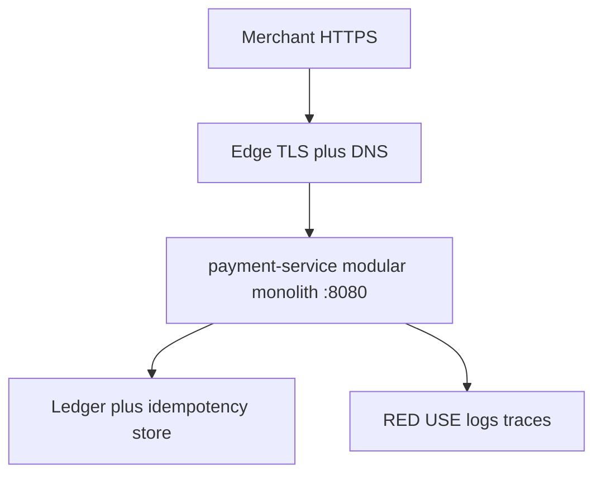

# L-16.8 — System design round

**Module:** 16 — Advanced Engineer Interview Simulator  
**Duration:** 30 minutes  
**Case study:** BayPay Financial Services (fictional)

---

## Why this matters

A design round is one BayPay problem, 45–60 minutes, and a page you can export. The panel is not asking you to invent a seventh microservice or a second region so the whiteboard looks expensive. They want Sam Okada and Priya Nair to hear **requirements, failure domains, and trade-offs** for `POST /api/v1/payments` while Harbor Bike Co charges Avery Chen `$84.00`. The portfolio artifact is [PF-design.md](../../../../student/worksheets/PF-design.md). Practice handles that feed the sketch: [AEJE-IQ-097](../../../../interview-bank/README.md) (modular monolith versus microservices) and [AEJE-IQ-093](../../../../interview-bank/README.md) (failure domains for 99.99 percent payments). Do not paste bank answers. Do not dump a full design from memory as if it were the only correct estate.

---

## Learning objectives

- Frame one design: actors, golden request, SLO, and what is out of scope.
- Place failure domains (task, AZ, edge, identity/TLS, data store, region) on paper.
- Defend modular monolith versus extract, and single-region multi-AZ versus DR, as funded choices.
- Export INTERVIEW-1604 notes into `PF-design.md`.

---

## Concept explanation

System design is a **mode**, not a 101st domain. The CLI will not whiteboard for you. INTERVIEW-1604 is paper. Leadership/Architecture and HA/Security records supply prompts you may hear on the way in.

**Shape the hour.** Engineer: draw the golden path — merchant HTTPS, edge TLS, `payment-service` on `8080`, `jdbc/baypay`, idempotency key, states `RECEIVED → … → COMPLETED`. Senior: add health, rollback, and the ops SLO (99.9% / P99 &lt; 400 ms) versus the architecture goal (99.99%). Staff: name what you will *not* build this quarter (mesh + EKS + OpenShift + leftover ND). Principal: write the ADR sentence and the RTO/RPO the business actually funded (AEJE-IQ-095 territory).

**Monolith first.** AEJE-IQ-097 is the extract question. Start with the modular monolith you already have. Extract when a boundary has a different SLO, a different team, or a different failure domain — not because a slide said “microservices.” An ADR that says no to a seventh service (AEJE-IQ-099) is a Staff-level design move.

**Failure domains.** Task, AZ, ALB/node, region, identity/TLS, data store. Multi-region is a DR conversation. Leftover `dmgr-east` is not a failover target. Do not apply a second region for the mock.

**Capacity is a design sentence.** You already sized RPS, Hikari, and heap in ops work. In this hour, say whether N+1 tasks and unused failover headroom are funded. A 99.99% box with one task per AZ is a drawing, not a design. Do not rerun the entire ops capacity lecture; name the HA number and move on.

Run related prompts with:

```bash
python3 interview-bank/simulator.py --mode practice --id AEJE-IQ-097
python3 interview-bank/simulator.py --mode practice --domain HA/Security
```

---

## Visual explanation



Alt text: One BayPay design sketch: merchant HTTPS through edge TLS into the modular monolith on port 8080, a ledger and idempotency store, and RED/USE/logs/traces — no seventh service and no leftover cell as failover.

---

## Architecture

Teaching defaults you must be willing to keep or *explicitly* replace: Java 21, Spring Boot 3.5.5, port `8080`, Actuator probes, ECS on Fargate in `us-west-2`, Secrets Manager / KMS alias `alias/baypay-payments`, paper secondary `us-east-1` only if the prompt is DR. OpenShift or EKS are allowed if you fund operations. ND-in-Docker is never allowed.

Riley owns in-process modules. Sam owns the platform choice. Priya owns SLI/SLO and 99.99% failure-domain math. Jordan owns rollout. Morgan’s cell appears only as a decommission line. Threat-model the idempotency store (AEJE-IQ-094): replay is a security design, not an afterthought. Secrets that must never be in a ConfigMap (AEJE-IQ-096) belong on the same sketch as KMS — if they are missing, the design is unfinished.

---

## Production example

A panelist says “design payments for 99.99%.” Engineer: I keep one process, multi-AZ tasks, a healthy front door, and a database story I can operate. Senior: I list domains — task death, AZ loss, edge cert, IAM, store. Staff: single-region multi-AZ can be a 99.99% *design*; multi-region is RTO. I will not silently upgrade the ops dashboard from 99.9% to 99.99%. Principal: I ask what RTO/RPO finance funded. Unfunded 99.99% is theater.

If they ask you to add Kafka, a mesh, and a second region in the first ten minutes, write the contradiction: you have not named the SLO or the team that pages those boxes. Put them in a “later, if funded” column on `PF-design.md`.

The bank stays at 100 ids. Design is a mode. Do not create a 101st “system design” question file.

Extract prompt (AEJE-IQ-097). Engineer: modules already exist (payment, refund, notification). Senior: I extract notification if its SLO and traffic shape diverge. Staff: I will not extract a seventh service for a resume. Principal: I read the ADR aloud and I own the “no.”

---

## Code/configuration example

Spoken outline — 45-minute design — not a completed `PF-design.md`:

```text
1. Repeat the prompt in one sentence. Name out-of-scope (PAN vault, card network, leftover ND).
2. Draw the golden path and the data store. Mark idempotency.
3. List failure domains and the SLO pair (ops 99.9 vs architecture 99.99).
4. Pick compute (Fargate default) and say what you rejected (EKS, OpenShift, ND-in-Docker).
5. Trade-offs table: two alternatives you did not pick. Stop for questions.
```

Illustrative note shape for the worksheet:

```json
{
  "id": "AEJE-IQ-097",
  "domain": "Leadership/Architecture",
  "question": "<design prompt — one BayPay problem>",
  "expectedConcepts": ["modular monolith", "extract trigger", "failure domain"],
  "engineerAnswer": "<draw today's process>",
  "seniorAnswer": "<when a module earns extraction>",
  "staffAnswer": "<ADR: no seventh service this quarter>",
  "principalAnswer": "<funded SLO and RTO; leftover cell is not DR>"
}
```

Do not put secrets or PAN in the diagram. Do not apply Terraform to “prove” the boxes. If the panel asks you to pick NLB versus ALB, prefer ALB for Avery’s HTTP JSON and say when L4 would apply — do not invent a listener RCA from an older incident pack.

---

## Trade-offs

| Choice | Gain | Cost |
|---|---|---|
| Modular monolith | One deploy; one TX | Team contention |
| Seventh service | Independent ship | Failure domains you cannot staff |
| Single-region multi-AZ | 99.99% design possible | Region is still a domain |
| Unfunded multi-region | Slide | Idle bill; fake RTO |
| Fargate default | Less node ops | AWS-shaped limits |

---

## Failure modes

- Starting with microservices before requirements.
- Using `dmgr-east` as HA.
- Upgrading the ops SLO on the dashboard without a contract change.
- Skipping threat model on idempotency replay.
- Applying NAT, EKS, or `us-east-1` to decorate the mock.
- One paragraph that ignores trade-offs.

---

## Security/reliability implications

Design is where replay, TLS ownership, and secret planes get funded — or forgotten. The idempotency store is a replay weapon if it is guessable or world-writable. Edge TLS expiry is an availability incident. Reliability: every new service is a new page rota. 99.99% without N+1 capacity and a tested rollback is a slogan. DR that fails over to a leftover cell is a second outage.

---

## Interview perspective

**Engineer.** I draw the golden path and the store. I keep the monolith.

**Senior.** I add probes, rollback, and the 99.9% ops sentence.

**Staff.** I name failure domains and I reject a seventh service without a trigger.

**Principal.** I only promise the RTO/RPO the business funded. I write the ADR.

---

## Key takeaways

- One BayPay design. Trade-offs required. Portfolio is `PF-design.md`.
- Use `AEJE-IQ-097` and `AEJE-IQ-093` as handles, not scripts.
- Monolith first. Extract with a reason.
- 99.9% ops versus 99.99% architecture — do not mash them.
- INTERVIEW-1604 starts after this lesson.

---

## Knowledge check

1. Which lab produces the system-design portfolio artifact, and which worksheet?
2. Why is “add a seventh service” a weak default in a BayPay design hour?
3. Can single-region multi-AZ in `us-west-2` be a 99.99% *design*?

<details>
<summary>Spoiler — answers</summary>

1. INTERVIEW-1604 and `student/worksheets/PF-design.md`.
2. Extraction needs a different SLO, team, or failure domain. Extra services are extra pages.
3. Yes, as an architecture design. It is not a silent upgrade of the 99.9% ops dashboard, and region loss is still a DR topic.

</details>

---

## Related lab

[INTERVIEW-1604](../../../../labs/INTERVIEW-1604/README.md) — System design, after this lesson. Time-box 60–90 minutes. One BayPay problem, trade-offs, export [PF-design.md](../../../../student/worksheets/PF-design.md). This lesson does not complete that worksheet.

---

## Related PAKS

Optional: `docs/24-system-design/overview.md` on [paks.bayareala8s.com](https://paks.bayareala8s.com). It deepens whiteboard structure. This lesson stands alone without a PAKS login.
