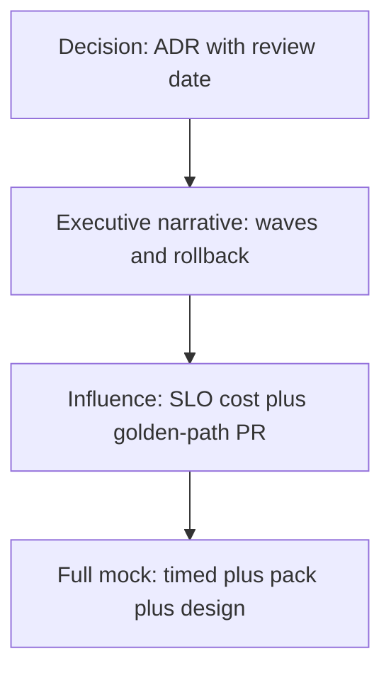

# L-16.9 — Leadership / architecture round

**Module:** 16 — Advanced Engineer Interview Simulator  
**Duration:** 30 minutes  
**Case study:** BayPay Financial Services (fictional)

---

## Why this matters

A Principal loop is not a longer JVM answer. The panel asks whether you can **set a decision, say no, and move a platform team that does not report to you** while Harbor Bike Co still charges Avery Chen. Riley Okonkwo can name a mechanism; a Principal names the ADR, the executive narrative, and the influence path. BayPay remains one fictional payments company — not a license to reorg the leftover cell by slogan. Practice handles: [AEJE-IQ-098](../../../../interview-bank/README.md) (executive narrative for a Liberty migration) and [AEJE-IQ-100](../../../../interview-bank/README.md) (influencing a platform team without authority). Do not paste bank answers.

---

## Learning objectives

- Separate Engineer mechanism-talk from Principal decision-talk without dropping technical truth.
- Write an ADR-shaped “no” (seventh service, ND-in-Docker, unfunded multi-region).
- Tell a Liberty-migration story a CIO can fund: waves, rollback, honest API gaps.
- Sit INTERVIEW-1605: practice or timed, troubleshooting, and a design slice in one loop.

---

## Concept explanation

Leadership/Architecture is **4** of **100** (`AEJE-IQ-097`–`AEJE-IQ-100`). You already used 097 in the design lesson. This round is 098–100 plus the *behavior* of the full mock loop in [ROUNDS.md](../../../../datasets/baypay-interview/ROUNDS.md).

**Narrative is a control.** AEJE-IQ-098: an executive story names risk (leftover cell, feature sprawl, secret planes), the wave plan, what will not move yet, and how rollback works. It does not promise “cloud by Friday.” Engineer still must know `server.xml`. Principal must not hide that knowledge behind strategy words.

**No is an artifact.** AEJE-IQ-099: an ADR states context, decision, consequences, and review date. “No seventh service” is a Staff/Principal deliverable. “No” without a review date becomes folklore.

**Influence without authority.** AEJE-IQ-100: Sam Okada’s platform team does not report to you. You bring a written SLO cost, a golden-path PR, and a pilot — not a slide that shames them. Principal answers name the meeting, the artifact, and the fallback if they refuse.

**Full mock loop.** INTERVIEW-1605 sequences more than one mode: practice or timed (8 minutes), a troubleshooting pack slice, and a design slice. One memorized paragraph still fails. Phase A is still paper plus `simulator.py`. No portal required. Score yourself with the same weights on diagnostic items: Technical 25 / Method 20 / Production 15 / Trade-off 15 / Security 10 / Comms 10 / Efficiency 5. Efficiency is how fast you reached a defensible stop, not how many services you drew.

Run:

```bash
python3 interview-bank/simulator.py --mode practice --id AEJE-IQ-098
python3 interview-bank/simulator.py --mode timed-interview --domain "Leadership/Architecture"
```

---

## Visual explanation



Alt text: Leadership interview stack: an ADR with a review date, an executive wave narrative, influence through artifacts rather than authority, then a full mock loop that mixes timed, troubleshooting, and design.

---

## Architecture

The estate you lead is the same estate you designed: modular monolith unless an ADR extracts; leftover ND waved down, never Dockerized; Fargate default in `us-west-2`; secrets in a store; 99.9% ops versus 99.99% architecture. You do not get a new product because the round is “leadership.”

The bank still has exactly 100 questions. Leadership prompts are four of them. Do not invent a second file of “executive” items when INTERVIEW-1605 needs more material — reuse domains you already practiced.

Priya funds error-budget policy. Jordan funds change gates. Sam funds golden paths. Riley funds the application contract. You fund the sentence that binds them. Keep mutating production behind a named human. A fluent summary is not a change ticket.

---

## Production example

CIO prompt (AEJE-IQ-098). Engineer: Liberty features and `server.xml` replace console folklore. Senior: wave 1 is the stateless payment API; UI affinity stays until it dies. Staff: I show the compatibility gaps I will not lie about. Principal: I ask for funding in waves with rollback; I say what we will not do (ND-in-Docker, weekend big-bang, fail over to `dmgr-east`).

Influence prompt (AEJE-IQ-100). Engineer: I wrote the probe contract I want. Senior: I opened a PR on the golden path, not a ticket that says “please modernize.” Staff: I bring idle-cost and SEV-1 notes from last quarter. Principal: if platform refuses, I narrow the pilot to `payment-service` in non-prod and I schedule the ADR review — I do not escalate as theater on day one.

ADR no (AEJE-IQ-099). The document says we stay a modular monolith this quarter because extract cost exceeds the SLO gain. Review in 90 days or when a module earns a different failure domain.

---

## Code/configuration example

Spoken outline — Principal hour and full mock:

```text
1. Restate the decision in one sentence (migrate, extract, or refuse).
2. Name the artifact: ADR, wave plan, or golden-path PR.
3. Name who must agree (Sam, Priya, Jordan) and what you will do if they do not.
4. Keep one technical check so the narrative is not vapor (feature set, probe, tag).
5. In INTERVIEW-1605: switch modes on purpose. Do not turn troubleshooting into a speech.
```

Illustrative record shape:

```json
{
  "id": "AEJE-IQ-100",
  "domain": "Leadership/Architecture",
  "difficulty": "principal",
  "question": "<simulator prompt>",
  "followUps": ["What if platform says no?", "What artifact do you leave behind?"],
  "expectedConcepts": ["no org authority", "pilot", "written SLO cost"],
  "engineerAnswer": "<the contract I want>",
  "seniorAnswer": "<PR not a shame slide>",
  "staffAnswer": "<cost and SEV notes>",
  "principalAnswer": "<narrow pilot plus ADR review date>"
}
```

Do not invent a second bank. Do not require Interview Accelerator or a BayLearn UI.

---

## Trade-offs

| Choice | Gain | Cost |
|---|---|---|
| ADR with review date | Reversible no | Looks slow |
| Slogan migration | Fast applause | No rollback |
| Shame-the-platform slide | Venting | Permanent resistance |
| Golden-path PR | Shared ownership | You must write it |
| Single-mode mock | Comfort | Misses 1605 |

---

## Failure modes

- Principal answers that never name a mechanism.
- Engineer answers that never name a decision.
- ND-in-Docker or leftover-cell failover as strategy.
- Escalation as the first influence move.
- Reciting `--reveal` in a timed item.
- Skipping troubleshooting or design in the full loop.

---

## Security/reliability implications

Leadership decisions allocate blast radius. A migration narrative that leaves secrets in the cell is a security fail. An extract that no team can page is a reliability fail. Influence that bypasses change management is how unreviewed flags reach Avery’s create. The full mock loop exists because real loops switch modes; stamina without method burns the error budget in the interview itself.

---

## Interview perspective

**Engineer.** I still name `server.xml`, probes, and JDK 21. Leadership does not excuse vagueness.

**Senior.** I bring a PR and a wave, not a slogan.

**Staff.** I write the ADR that says no, with consequences and a review date.

**Principal.** I influence without authority, fund only promised RTO, and I will not accept ND-in-Docker.

---

## Key takeaways

- Four Leadership/Architecture records: 097–100. This lesson emphasizes 098 and 100.
- Narrative, ADR, influence — each is an artifact.
- Technical truth stays in the Principal answer.
- INTERVIEW-1605 mixes timed, pack, and design.
- Phase A: paper plus `simulator.py`. No portal.

---

## Knowledge check

1. What three pieces belong in an executive Liberty-migration narrative?
2. You do not manage the platform team. What do you bring besides a slide?
3. Full mock loop (INTERVIEW-1605) should include which modes?

<details>
<summary>Spoiler — answers</summary>

1. Risk, waves with rollback, and honest “not yet” / API gaps — not “cloud by Friday.”
2. A golden-path PR, a written SLO or idle-cost note, and a narrow pilot with an ADR review date.
3. More than one mode in one sitting: practice or timed, troubleshooting, and a design slice.

</details>

---

## Related lab

[INTERVIEW-1605](../../../../labs/INTERVIEW-1605/README.md) — Full mock loop, after this lesson. Time-box 75–120 minutes. Include one timed item. Reuse method from INTERVIEW-1601–1604. This lesson does not complete the loop and does not print bank answers.

---

## Related PAKS

Optional: `docs/25-architecture-leadership/overview.md` on [paks.bayareala8s.com](https://paks.bayareala8s.com). It deepens influence and ADR practice. This lesson stands alone without a PAKS login.
