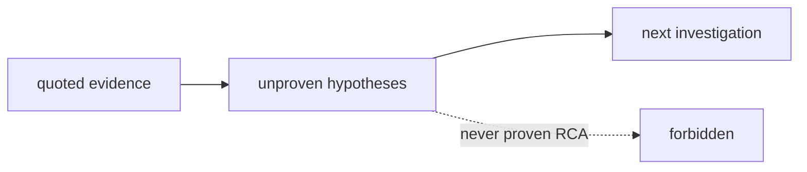

# AEJE-D-068 — Evidence vs hypothesis

- Type: concept
- Module: 15
- Maps to: L-15.2
- Complexity: 2

```mermaid
flowchart LR
  Ev[quoted evidence] --> Hyp[unproven hypotheses]
  Hyp --> Inv[next investigation]
  Hyp -.->|never proven RCA| X[forbidden]
```
