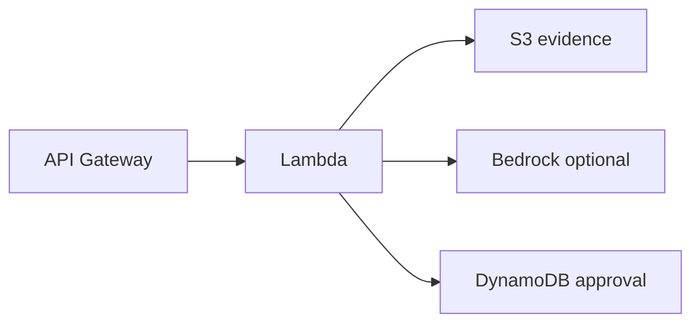

# AEJE-D-069 — BayOps AI architecture

- Type: component
- Module: 15
- Maps to: AI-1501
- Complexity: 3

```mermaid
flowchart LR
  APIGW[API Gateway] --> Lbd[Lambda]
  Lbd --> S3[S3 evidence]
  Lbd --> Br[Bedrock optional]
  Lbd --> DDB[DynamoDB approval]
```
