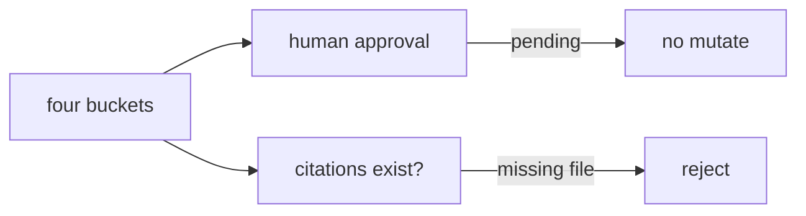

# AEJE-D-070 — Human approval and hallucination detection

- Type: concept
- Module: 15
- Maps to: L-15.6
- Complexity: 3

```mermaid
flowchart LR
  Out[four buckets] --> Hum[human approval]
  Out --> Cite[citations exist?]
  Cite -->|missing file| Rej[reject]
  Hum -->|pending| Wait[no mutate]
```
