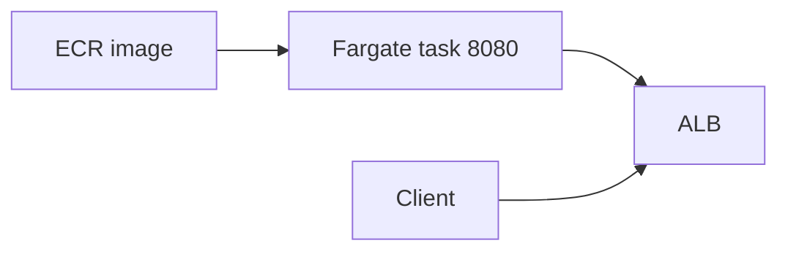

# AEJE-D-048 — ECR and ECS/Fargate BayPay

- Type: deployment
- Module: 11
- Maps to: BUILD-1101
- Complexity: 3

```mermaid
flowchart LR
  ECR[ECR image] --> Task[Fargate task 8080]
  Task --> ALB[ALB]
  Client --> ALB
```
