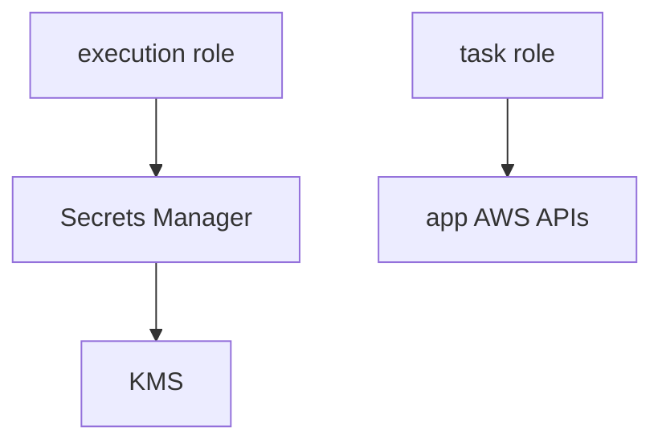

# AEJE-D-050 — IAM, Secrets Manager and KMS

- Type: security-trust-boundary
- Module: 11
- Maps to: SECURITY-1103
- Complexity: 3

```mermaid
flowchart TB
  Exec[execution role] --> SM[Secrets Manager]
  SM --> KMS[KMS]
  Task[task role] --> App[app AWS APIs]
```
