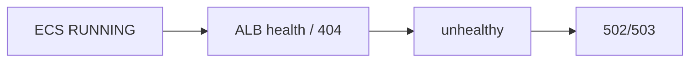

# AEJE-D-051 — Unhealthy ALB target

- Type: incident
- Module: 11
- Maps to: INCIDENT-1104
- Complexity: 3

```mermaid
flowchart LR
  Task[ECS RUNNING] --> HC[ALB health / 404]
  HC --> Un[unhealthy]
  Un --> S503[502/503]
```
