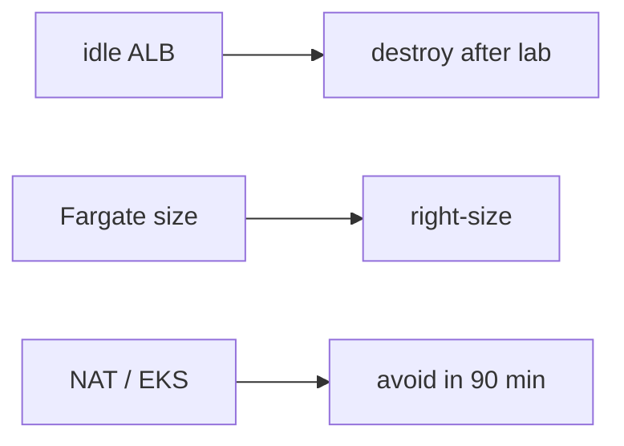

# AEJE-D-052 — Cost optimization levers

- Type: concept
- Module: 11
- Maps to: COST-1105
- Complexity: 2

```mermaid
flowchart LR
  Idle[idle ALB] --> Stop[destroy after lab]
  Size[Fargate size] --> Right[right-size]
  Nat[NAT / EKS] --> Avoid[avoid in 90 min]
```
