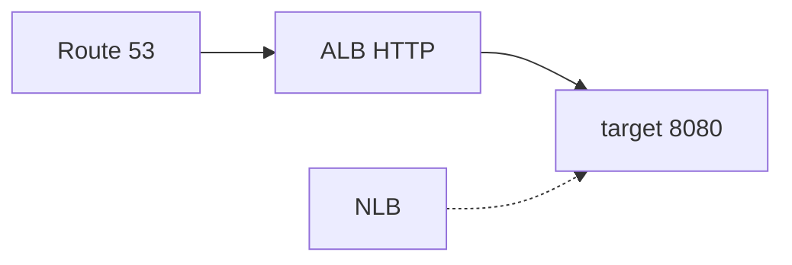

# AEJE-D-053 — ALB, NLB and Route 53

- Type: network
- Module: 11
- Maps to: L-11.4
- Complexity: 2

```mermaid
flowchart LR
  R53[Route 53] --> ALB[ALB HTTP]
  ALB --> TG[target 8080]
  NLB[NLB] -.-> TG
```
