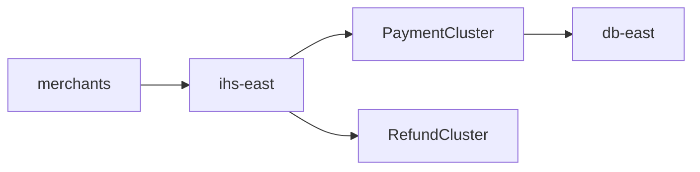

# AEJE-D-071 — BayPay initial WebSphere topology

- Type: current-state-target-state
- Maps to: overview
- Complexity: 2

```mermaid
flowchart LR
  Merch[merchants] --> IHS[ihs-east]
  IHS --> Pay[PaymentCluster]
  IHS --> Ref[RefundCluster]
  Pay --> DB[db-east]
```
