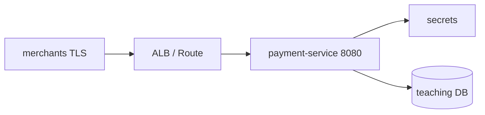

# AEJE-D-072 — Cloud-native BayPay target state

- Type: current-state-target-state
- Maps to: CAPSTONE-2
- Complexity: 4

```mermaid
flowchart LR
  Merch[merchants TLS] --> ALB[ALB / Route]
  ALB --> Pay[payment-service 8080]
  Pay --> SM[secrets]
  Pay --> DB[(teaching DB)]
```
