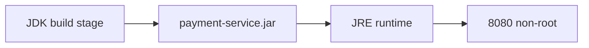

# AEJE-D-039 — BayPay container image

- Type: component
- Module: 9
- Maps to: BUILD-901
- Complexity: 2

```mermaid
flowchart LR
  Build[JDK build stage] --> Jar[payment-service.jar]
  Jar --> Runtime[JRE runtime]
  Runtime --> Port[8080 non-root]
```
