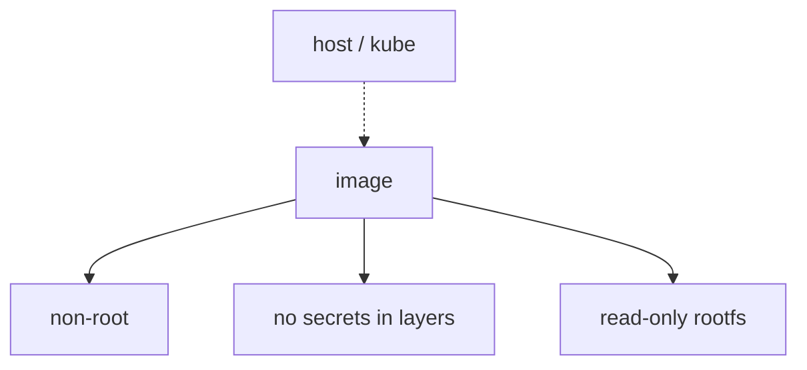

# AEJE-D-040 — Container trust boundary

- Type: security-trust-boundary
- Module: 9
- Maps to: SECURITY-903
- Complexity: 3

```mermaid
flowchart TB
  Img[image] --> User[non-root]
  Img --> Sec[no secrets in layers]
  Img --> Fs[read-only rootfs]
  Host[host / kube] -.-> Img
```
