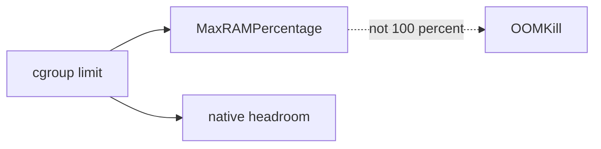

# AEJE-D-041 — Java resource sizing

- Type: concept
- Module: 9
- Maps to: L-9.6
- Complexity: 2

```mermaid
flowchart LR
  Limit[cgroup limit] --> Heap[MaxRAMPercentage]
  Limit --> Native[native headroom]
  Heap -.->|not 100 percent| Kill[OOMKill]
```
