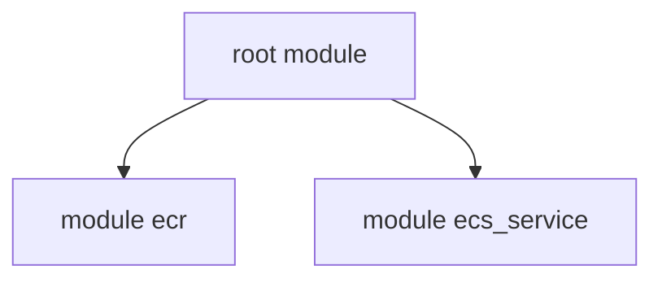

# AEJE-D-055 — Reusable Terraform modules

- Type: component
- Module: 12
- Maps to: BUILD-1202
- Complexity: 2

```mermaid
flowchart TB
  Root[root module] --> ECR[module ecr]
  Root --> ECS[module ecs_service]
```
