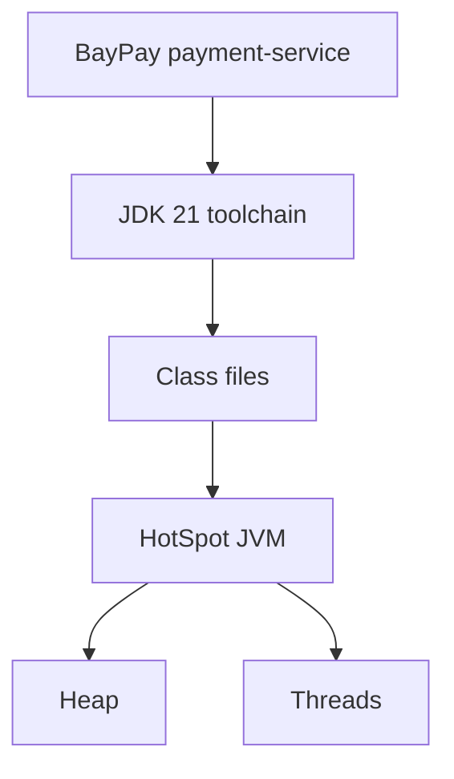

# AEJE-D-001 — Modern Java, JDK and JVM stack

- Type: concept
- Module: 1
- Maps to: L-1.1
- Complexity: 1

```mermaid
flowchart TB
  JDK[JDK 21 toolchain] --> Bytecode[Class files]
  Bytecode --> JVM[HotSpot JVM]
  JVM --> Heap[Heap]
  JVM --> Threads[Threads]
  App[BayPay payment-service] --> JDK
```
