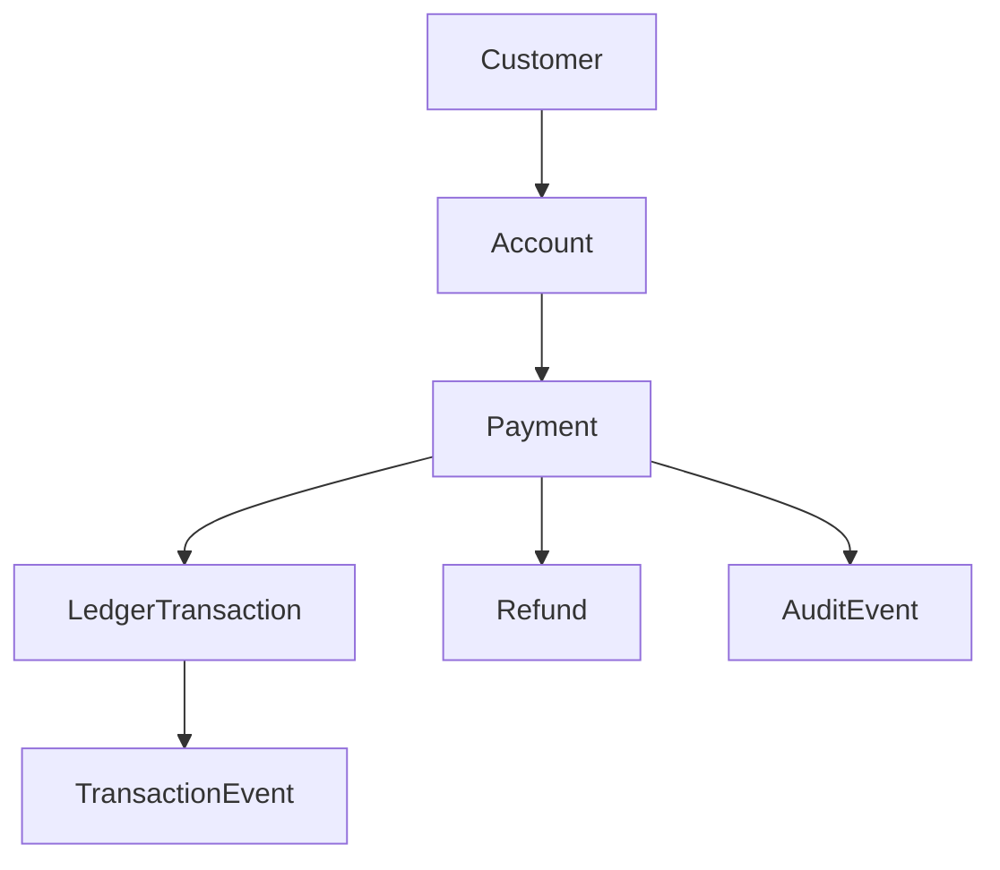

# AEJE-D-003 — BayPay transaction domain model

- Type: component
- Module: 1
- Maps to: BUILD-101
- Complexity: 2

```mermaid
flowchart TB
  Customer --> Account
  Account --> Payment
  Payment --> Ledger[LedgerTransaction]
  Payment --> Refund
  Ledger --> TE[TransactionEvent]
  Payment --> Audit[AuditEvent]
```
