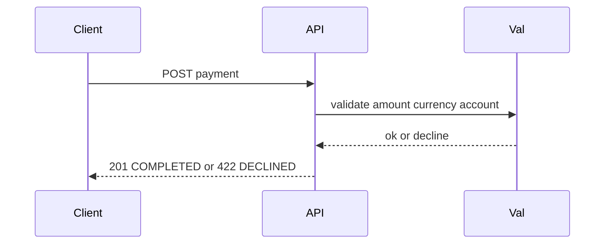

# AEJE-D-004 — Payment validation flow

- Type: sequence
- Module: 1
- Maps to: BUILD-102
- Complexity: 2

```mermaid
sequenceDiagram
  Client->>API: POST payment
  API->>Val: validate amount currency account
  Val-->>API: ok or decline
  API-->>Client: 201 COMPLETED or 422 DECLINED
```
