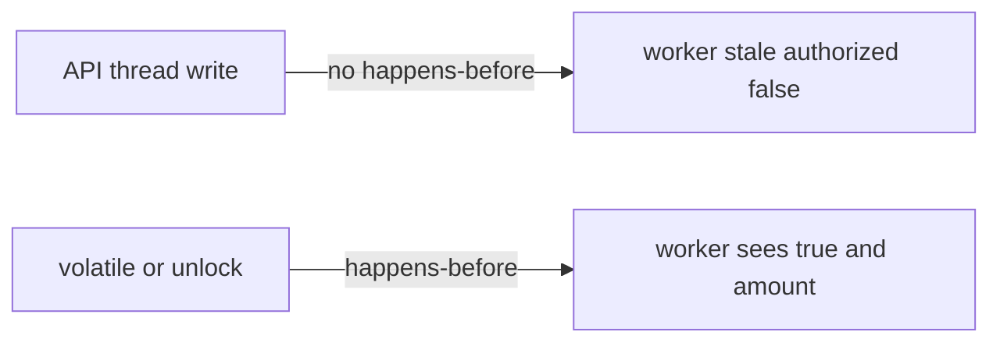

# AEJE-D-005 — Java memory visibility

- Module: 2
- Maps to: L-2.1
- Complexity: 1

```mermaid
flowchart LR
  T1[API thread write] -->|no happens-before| Cache[worker stale authorized false]
  T1b[volatile or unlock] -->|happens-before| Main[worker sees true and amount]
```
