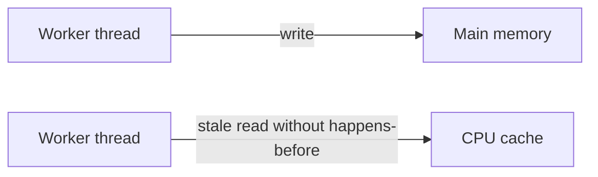

# AEJE-D-005 — Java memory visibility

- Type: concept
- Module: 2
- Maps to: L-2.1
- Complexity: 1

```mermaid
flowchart LR
  T1[Worker thread] -->|write| Main[Main memory]
  T2[Worker thread] -->|stale read without happens-before| Cache[CPU cache]
```
