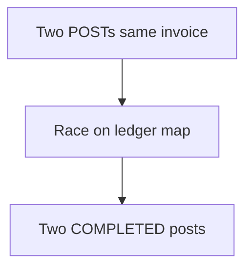

# AEJE-D-006 — Duplicate payment race

- Type: incident
- Module: 2
- Maps to: BREAKFIX-201
- Complexity: 3

```mermaid
flowchart TB
  A[Two POSTs same invoice] --> R[Race on ledger map]
  R --> Dup[Two COMPLETED posts]
```
