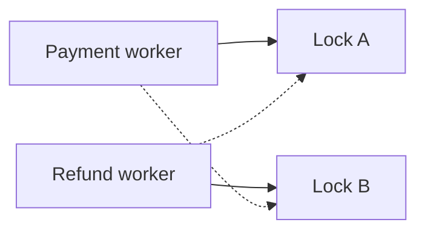

# AEJE-D-007 — Deadlocked payment workers

- Type: incident
- Module: 2
- Maps to: INCIDENT-202
- Complexity: 3

```mermaid
flowchart LR
  PW[Payment worker] --> L1[Lock A]
  RW[Refund worker] --> L2[Lock B]
  PW -.-> L2
  RW -.-> L1
```
