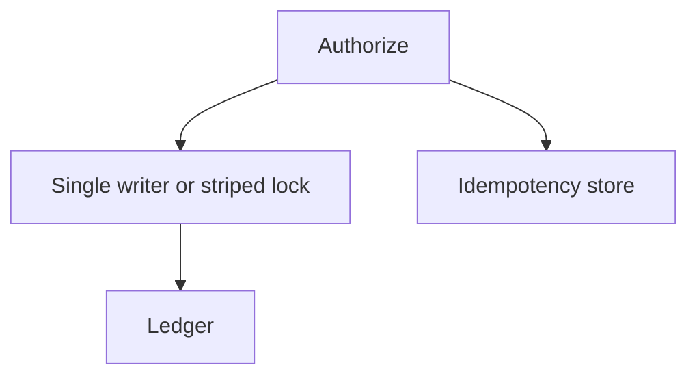

# AEJE-D-008 — Safe concurrent payment processing

- Type: component
- Module: 2
- Maps to: ARCHITECT-203
- Complexity: 3

```mermaid
flowchart TB
  In[Authorize] --> Q[Single writer or striped lock]
  Q --> Ledger[Ledger]
  In --> Idem[Idempotency store]
```
