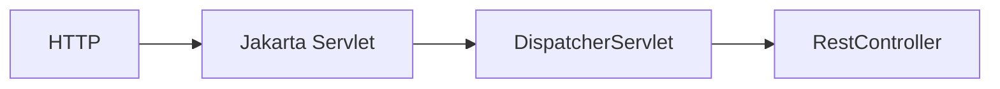

# AEJE-D-014 — Servlet and Jakarta EE model

- Type: concept
- Module: 4
- Maps to: L-4.1
- Complexity: 1

```mermaid
flowchart LR
  HTTP --> Servlet[Jakarta Servlet]
  Servlet --> Spring[DispatcherServlet]
  Spring --> Ctrl[RestController]
```
