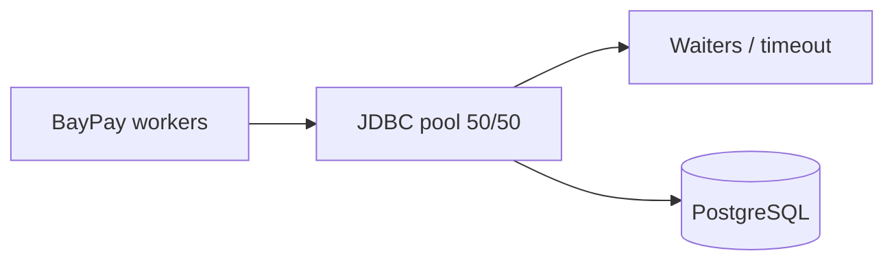

# AEJE-D-016 — Connection pool exhaustion

- Type: incident
- Module: 4
- Maps to: INCIDENT-402
- Complexity: 3

```mermaid
flowchart LR
  App[BayPay workers] --> Pool[JDBC pool 50/50]
  Pool --> Wait[Waiters / timeout]
  Pool --> DB[(PostgreSQL)]
```
