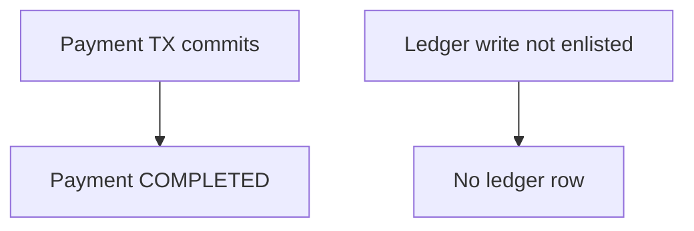

# AEJE-D-017 — Transaction boundary failure

- Type: incident
- Module: 4
- Maps to: INCIDENT-403
- Complexity: 3

```mermaid
flowchart TB
  Tx1[Payment TX commits]
  Tx2[Ledger write not enlisted]
  Tx1 --> PayOK[Payment COMPLETED]
  Tx2 --> Missing[No ledger row]
```
