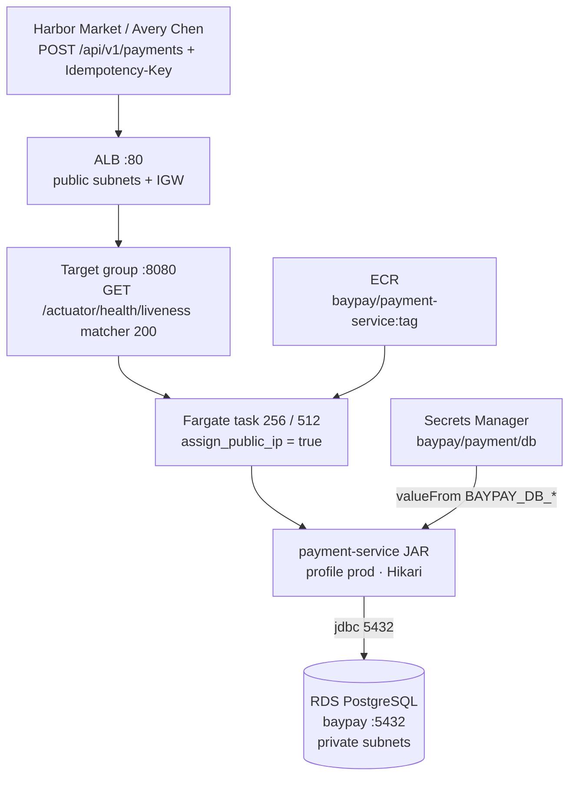

# BayPay ECS / Fargate + RDS PostgreSQL

**Type:** deploy (design)  
**Region:** `us-west-2`  
**Image:** `baypay/payment-service:<immutable-tag>` (same JAR as EKS)  
**Student apply:** ECS/Fargate + ALB optional; **do not apply RDS / NAT / EKS**

Teaching edge: `pay-alb-student.baypay.example` (real apply uses the AWS ALB DNS).

Alt text: Merchants hit an ALB in us-west-2. The target group health-checks Actuator liveness on 8080. A Fargate task runs the Spring Boot fat JAR from ECR. Secrets Manager injects the JDBC URL. The JAR talks to RDS PostgreSQL on 5432 in private subnets.
