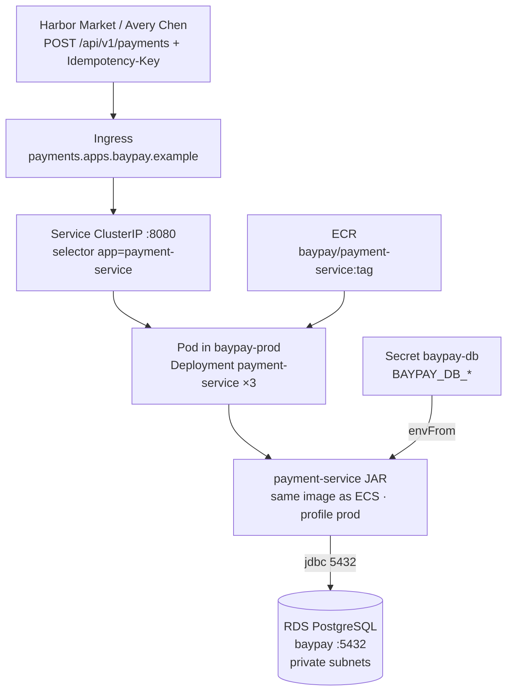

# BayPay EKS + RDS PostgreSQL

**Type:** deploy (design)  
**Region:** `us-west-2`  
**Image:** `baypay/payment-service:<immutable-tag>` (**same OCI image as ECS**)  
**Student apply:** **do not apply EKS**, NAT, or RDS Multi-AZ

Teaching edge: `https://payments.apps.baypay.example` (Ingress). OpenShift Route `payment-route` is the same job.

Alt text: Merchants hit Ingress on payments.apps.baypay.example. A ClusterIP Service on 8080 selects payment-service pods. Those pods run the same Spring Boot image as Fargate. A Secret injects JDBC credentials. The JAR talks to RDS PostgreSQL on 5432.
