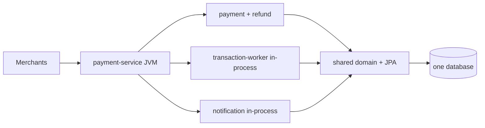

# BayPay picture 1 — Modular monolith

- Maps to: reference-apps/baypay, GETTING_STARTED, Module 1
- Complexity: 1

```mermaid
flowchart LR
  M[Merchants] --> API[payment-service JVM]
  API --> Pay[payment + refund]
  API --> W[transaction-worker in-process]
  API --> N[notification in-process]
  Pay --> S[shared domain + JPA]
  W --> S
  N --> S
  S --> DB[(one database)]
```
