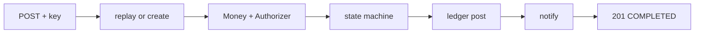

# BayPay picture 3 — Create-payment path

- Maps to: reference-apps/baypay, GETTING_STARTED, Module 1
- Complexity: 1

```mermaid
flowchart LR
  P[POST + key] --> R[replay or create]
  R --> A[Money + Authorizer]
  A --> SM[state machine]
  SM --> L[ledger post]
  L --> N[notify]
  N --> C[201 COMPLETED]
```
