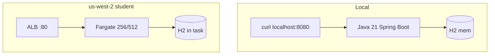

# BayPay picture 2 — Local and student AWS stack

- Maps to: reference-apps/baypay, GETTING_STARTED, Module 1
- Complexity: 1

```mermaid
flowchart TB
  subgraph Local
    C[curl localhost:8080] --> SB[Java 21 Spring Boot]
    SB --> H2[(H2 mem)]
  end
  subgraph AWS[us-west-2 student]
    A[ALB :80] --> F[Fargate 256/512]
    F --> H2b[(H2 in task)]
  end
```
