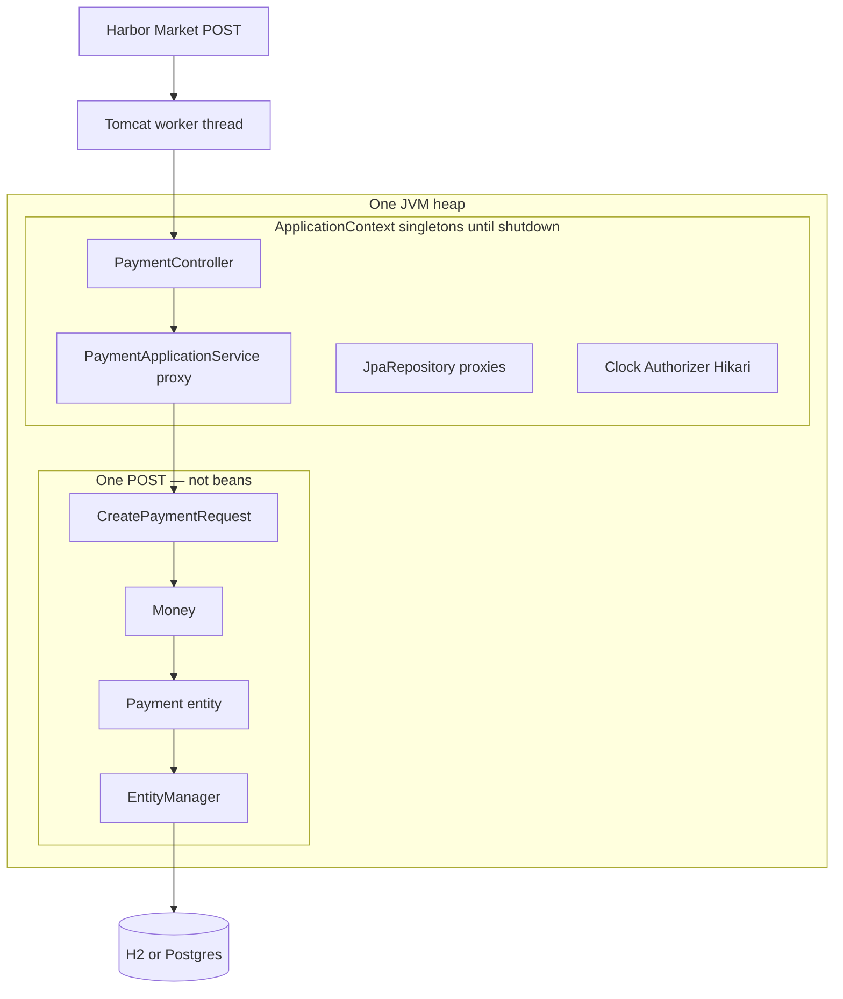

# Spring object lifetime — BayPay process

Teaching picture for [reference-apps/baypay](../../../reference-apps/baypay/README.md).
Not a new AEJE-D catalog ID. BayPay is fictional.

**Slide:** [spring-object-lifetime.png](spring-object-lifetime.png)  
**Edit:** [spring-object-lifetime.svg](spring-object-lifetime.svg)

Read top to bottom: **client is not a bean → process holds the context → request objects are garbage after 201 → the row is what remains.**
