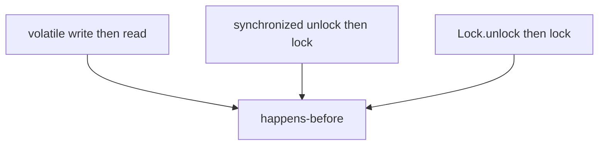

# L-2.1 picture 3 — volatile, synchronized, lock/unlock

- Module: 2
- Maps to: L-2.1
- Complexity: 1

```mermaid
flowchart TB
  V[volatile write then read] --> HB[happens-before]
  S[synchronized unlock then lock] --> HB
  L[Lock.unlock then lock] --> HB
```
