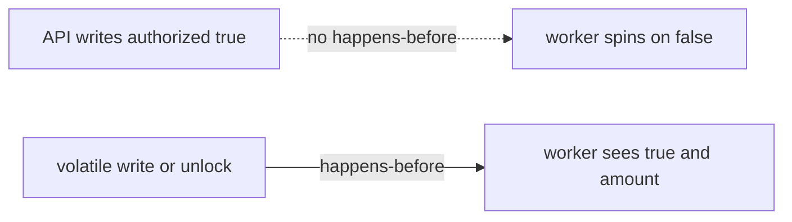

# L-2.1 picture 2 — Stale authorized versus happens-before

- Module: 2
- Maps to: L-2.1
- Complexity: 1

```mermaid
flowchart LR
  API[API writes authorized true] -.->|no happens-before| W[worker spins on false]
  API2[volatile write or unlock] -->|happens-before| W2[worker sees true and amount]
```
