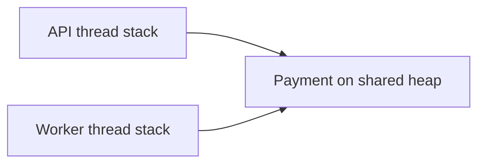

# L-2.1 picture 1 — Threads, stack, and heap

- Module: 2
- Maps to: L-2.1
- Complexity: 1

```mermaid
flowchart LR
  API[API thread stack] --> Pay[Payment on shared heap]
  WRK[Worker thread stack] --> Pay
```
