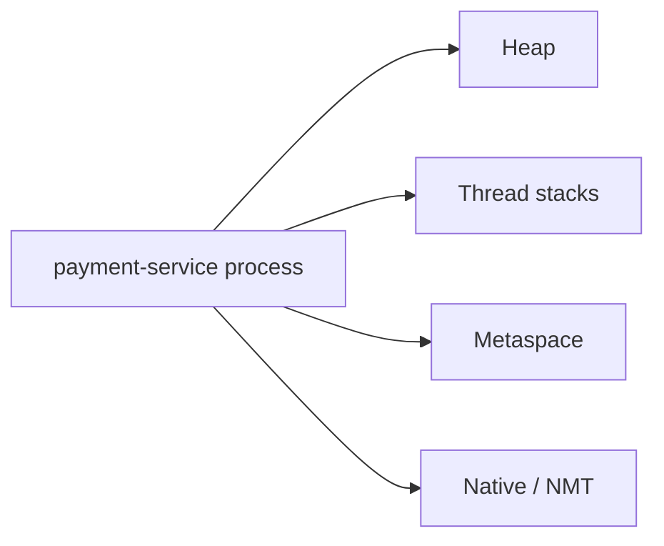

# AEJE-D-028 — Heap, stacks, metaspace and native memory

- Type: concept
- Module: 7
- Maps to: L-7.1
- Complexity: 1

```mermaid
flowchart LR
  P[payment-service process] --> H[Heap]
  P --> S[Thread stacks]
  P --> M[Metaspace]
  P --> N[Native / NMT]
```
