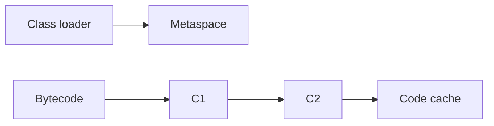

# AEJE-D-029 — Class loading and JIT

- Type: concept
- Module: 7
- Maps to: L-7.2
- Complexity: 2

```mermaid
flowchart LR
  CL[Class loader] --> Meta[Metaspace]
  Byte[Bytecode] --> C1[C1]
  C1 --> C2[C2]
  C2 --> Code[Code cache]
```
