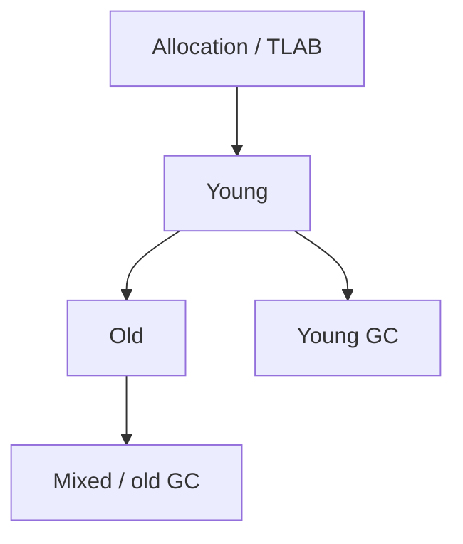

# AEJE-D-030 — Garbage collection

- Type: concept
- Module: 7
- Maps to: L-7.4
- Complexity: 2

```mermaid
flowchart TB
  Alloc[Allocation / TLAB] --> Young[Young]
  Young --> Old[Old]
  Young --> GC[Young GC]
  Old --> Mixed[Mixed / old GC]
```
