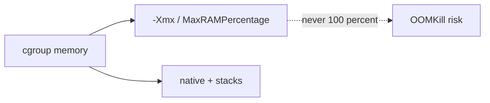

# AEJE-D-031 — JVM in containers

- Type: concept
- Module: 7
- Maps to: L-7.6
- Complexity: 3

```mermaid
flowchart LR
  Cgroup[cgroup memory] --> Heap[-Xmx / MaxRAMPercentage]
  Cgroup --> Native[native + stacks]
  Heap -.->|never 100 percent| Kill[OOMKill risk]
```
