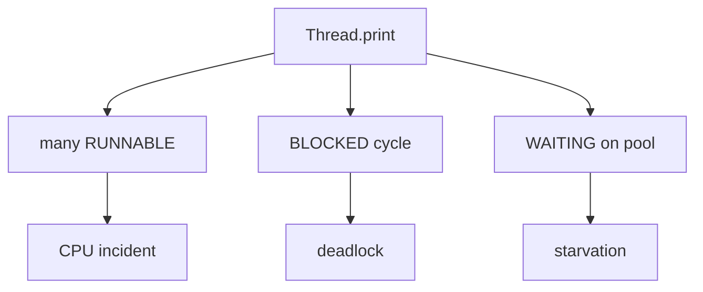

# AEJE-D-032 — Thread-dump decision tree

- Type: troubleshooting-decision-tree
- Module: 8
- Maps to: L-8.1
- Complexity: 3

```mermaid
flowchart TB
  Dump[Thread.print] --> R[many RUNNABLE]
  Dump --> B[BLOCKED cycle]
  Dump --> W[WAITING on pool]
  R --> CPU[CPU incident]
  B --> DL[deadlock]
  W --> Starve[starvation]
```
