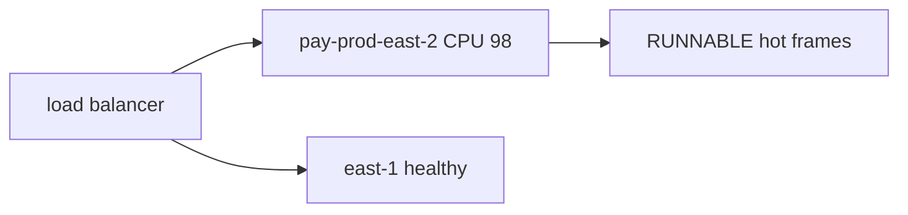

# AEJE-D-033 — CPU 98 percent

- Type: incident
- Module: 8
- Maps to: INCIDENT-801
- Complexity: 3

```mermaid
flowchart LR
  LB[load balancer] --> E2[pay-prod-east-2 CPU 98]
  LB --> E1[east-1 healthy]
  E2 --> Threads[RUNNABLE hot frames]
```
