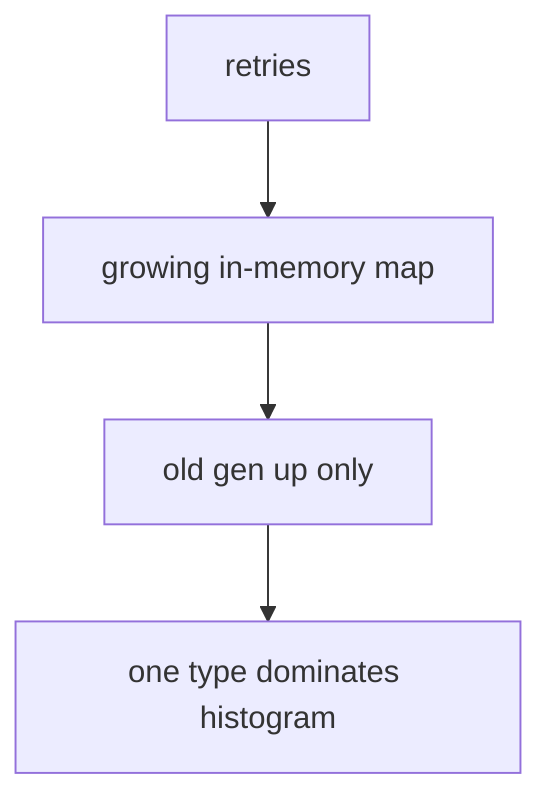

# AEJE-D-034 — Memory leak

- Type: incident
- Module: 8
- Maps to: INCIDENT-802
- Complexity: 3

```mermaid
flowchart TB
  Traffic[retries] --> Map[growing in-memory map]
  Map --> Old[old gen up only]
  Old --> Hist[one type dominates histogram]
```
