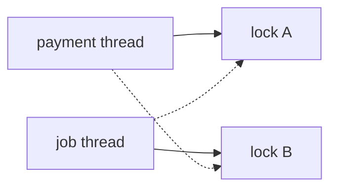

# AEJE-D-035 — Deadlock

- Type: incident
- Module: 8
- Maps to: INCIDENT-803
- Complexity: 3

```mermaid
flowchart LR
  T1[payment thread] --> L1[lock A]
  T2[job thread] --> L2[lock B]
  T1 -.-> L2
  T2 -.-> L1
```
